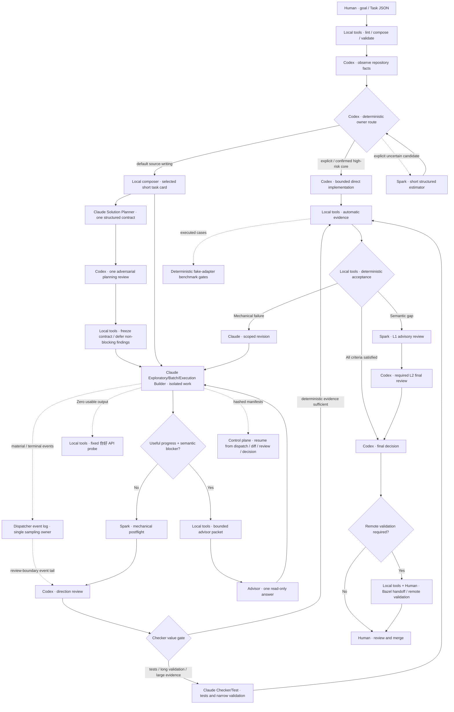

# AI Coding Workflow Skill

A reusable Codex / Claude Code workflow skill for installing a local multi-agent coding workflow into software repositories.

English | [中文](README_CN.md)

## Should you use this Skill?

This is a quota-allocation workflow, not a universal way to edit code. Its main
benefit is moving substantial planning and implementation to a cost-efficient
model accessed through Claude Code while
keeping Codex focused on intent and bounded semantic review.

| Use it when | Prefer ordinary Codex/local tools when |
|---|---|
| Codex quota is scarce and cost-efficient Claude Code capacity is available | The edit is tiny, obvious, or urgent |
| A feature, migration, batch, test effort, or validation run has durable delegated output | You only need a code answer, review, or read-only investigation |
| Longer single-task latency is acceptable, especially while several repositories run in separate terminals | One task is latency-sensitive or needs tight interactive debugging |
| Worktree isolation and deterministic review evidence are available | Claude execution, isolation, or reliable evidence is unavailable |
| Delegation removes material Codex planning/editing work | Codex already has the exact context and orchestration costs more than the change |

Installing the Skill does not require every task to use it. For a poor fit,
record `workflow bypassed: <reason>` and proceed directly without task-card or
Spark overhead.

## Claude-first routing for scarce Codex quota

The default `claude-first` profile minimizes Codex planning and editing work.
Claude owns planning, implementation, revision, assigned tests, and long
validation; Codex freezes intent and performs one bounded semantic review.
Single-task latency is advisory because users can run different repositories in
independent CLI terminals. Set `ownership_profile=economy-first` to restore the
strict total-cost and latency gate.

`quota-ledger.py` enforces call budgets and duplicate-evidence guards. `evaluate-acceptance.py` performs L0 deterministic checks, `select-review-tier.py` chooses L0 local/L1 Spark/L2 Codex, `context-cache.py` reuses bounded locator evidence, and `check-retry-evidence.py` blocks retries without changed evidence. The `quota-efficient-balanced` profile uses a 32 KB Standard review packet.

For Bazel repositories, `build-bazel-context.py` turns a bounded list of source files into candidate BUILD rules, dependencies, test targets, and narrow validation commands without running Bazel. Remote Bazel handoff remains human-controlled: `generate-handoff.py` emits preview-only publish/update/batched-validation instructions, while `validation-ingest.py` classifies returned logs locally. These helpers never push, SSH, merge, or authorize acceptance.

The primary quota-efficient path is preview-first:

```bash
python scripts/aiwf.py run task.json --run-dir .ai-workflow/runs/T-1
# Review the routing, context, execution plan, and dispatch preview first.
python scripts/aiwf.py run task.json --run-dir .ai-workflow/runs/T-1 --execute
```

`aiwf run` performs lint → profile validation → repository facts → deterministic
routing. The normal result is a short Claude execution card with context inlined
once. Open multi-phase features use Claude `solution-planner`, then return frozen
slices to `exploratory-builder`, `batch-builder`, or `execution-builder`.
Explicit/high-risk Codex work stops before card construction. Spark may fill a
structured uncertainty when that avoids Codex analysis. Preview remains zero-model.

The lower-level control-plane commands remain available:

```bash
python scripts/aiwf.py efficient prepare --hints task-hints.json --task-card task.md --output-dir .ai-workflow/runs/T-1
python scripts/aiwf.py dispatch-efficient --plan .ai-workflow/runs/T-1/execution-plan.json --task-card task.md --output-dir .ai-workflow/runs/T-1/dispatch
# Add --execute only after reviewing dispatch-preview.json.
python scripts/aiwf.py efficient review --plan .ai-workflow/runs/T-1/execution-plan.json --evidence evidence.json --milestone final-candidate --output .ai-workflow/runs/T-1/review.json
```

`prepare` writes cards and Context Packets for Claude-first work. Explicit Codex
fast-path needs no `--task-card`. `preflight-bundle` remains diagnostic;
structured Spark routing/monitoring is used only when it replaces Codex work.

## What it does

The installed skill uses progressive disclosure: its small `SKILL.md` contains only the core loop and non-negotiable rules, while setup, Spark, Claude runtime, worktree/parallel, and task-card details live in first-level `references/` files loaded only for matching operations. A size-budget test prevents the default skill context from silently growing beyond 18 KB.

ai-coding-workflow bootstraps repositories with:
- `AGENTS.md` - shared rules for all agents
- `CLAUDE.md` - Claude Code execution rules
- Task-card and evidence-packet templates
- Safe dispatch/review/loop scripts for Codex + Claude Code workflows
- Opt-in Spark structured routing/monitoring with direct short output; long preflight remains diagnostic-only
- Two-stage Claude progress semantics: edit readiness is advisory, while durable product writes drive active/idle decisions
- Worktree-aware CodeGraph receipts that reject stale or different-worktree graph evidence
- Execution profiles for token-saving balanced dispatch, safe full-context dispatch, and explicit fast large-repository dispatch
- Large-repository dispatch options for managed worktree reuse and reduced expensive untracked-file scans
- Local-validation gates and task-card validation command extraction
- Builder / Checker-Test task modes for separating implementation from validation
- Direction / boundary acknowledgement gates with anti-loop rules
- Managed blocks for idempotent updates

## Workflow at a glance



The control loop is **OBSERVE → ROUTE → PLAN → EXECUTE → VERIFY → REVIEW**.
ROUTE defaults source-writing to Claude. Codex direct is explicit or reserved for
confirmed high-risk core semantics and deterministic reviewed corrections.
Checker/Test remains conditional; humans merge.

Claude is the default implementer. `exploratory-builder` owns bounded feature
work with an unclear path; `batch-builder` owns mechanical work; and
`execution-builder` owns frozen solutions. Risk may bias only toward Codex.
Portfolio concurrency is not implemented by the Skill: run one repository per
terminal instead of building a cross-project DAG.

For a large or multi-phase feature, Claude drafts one structured end-state
contract, Codex performs one adversarial review, and the helper freezes it. Each
frozen slice then returns to Claude implementation. Only blocking invariants or
explicit spec changes reopen planning.

The selected role reaches runtime directly: `solution-planner` maps to
`solution-planning`, `exploratory-builder` to `exploratory`, `batch-builder` to
`batch`, and `execution-builder` to `execution-only`.

## Common actions

| Action | When | Command |
|--------|------|---------|
| **Guided setup (preview)** | See all phases before running | `python scripts/update_skill.py --setup-current` |
| **Guided setup (apply)** | One-command skill update + repo setup + tools + doctor | `python scripts/update_skill.py --setup-current --apply` |
| **Guided setup repo (preview)** | Preview guided setup for a specific repository | `python scripts/update_skill.py --setup-repo /path/to/repo` |
| **Guided setup repo (apply)** | Run guided setup for a specific repository | `python scripts/update_skill.py --setup-repo /path/to/repo --apply` |
| **Install Skill** | Once per computer | `python scripts/install_for_codex.py` |
| **Update Skill** | After pulling a newer checkout | `python scripts/update_skill.py --bootstrap-current` |
| **Bootstrap project** | Once per repository | `python scripts/install_workflow.py .` |
| **Bootstrap local-only** | Repositories that should not commit workflow control-plane files | `python scripts/install_workflow.py . --local-only` |
| **Auto-setup repo** | Detect profiles and plan LSP/CodeGraph/Zoekt | `python scripts/install_for_codex.py --auto-setup /path/to/repo` |
| **Auto-setup apply** | Install missing LSP tools and init CodeGraph/Zoekt | `python scripts/install_for_codex.py --auto-setup /path/to/repo --apply` |
| **Refresh project workflow** | Existing bootstrapped repository | `python scripts/install_workflow.py . --update-workflow-files` |
| **Claude provider check** | Show the effective CC Switch endpoint/model without secrets | `python scripts/claude-healthcheck.py` |
| **Claude endpoint probe** | Advisory network evidence; transient failure does not block dispatch | `python scripts/claude-healthcheck.py --probe` |
| **Claude interaction probe** | Send fixed `你好` in the dispatch network context; restricted-sandbox failure is inconclusive and user-terminal success wins | `python scripts/claude-healthcheck.py --interaction-route auto --timeout 60` |
| **Advisor continuation packet** | Continue useful on-plan work after one semantic blocker answer | `python scripts/aiwf.py advisor-continuation --help` |
| **Cross-sandbox process check** | Treat invisible dispatch PIDs as unknown, never as permission to launch a duplicate Builder | `CLAUDE_CODE_PROCESS_VISIBILITY=auto bash scripts/status-claude.sh <task-id>` |
| **Classify Claude round** | Decide whether a failure counts toward takeover | `python scripts/classify-claude-attempt.py --exit-code N --outcome NAME` |
| **Validate Claude context** | Check execution-only packet density | `python scripts/validate-claude-context.py task.md --require-complete` |
| **Preview integrated run** | Inspect every phase without model calls | `python scripts/aiwf.py run task.json --run-dir .ai-workflow/runs/T-1` |
| **Execute integrated run** | Run the reviewed plan | `python scripts/aiwf.py run task.json --run-dir .ai-workflow/runs/T-1 --execute` |

Advisor calls require a non-empty request/evidence binding and an explicit one-call cap. The Broker enforces the same `request_id` cap across roles and records interrupts as cancelled. Fixed Claude probes are `diagnostic_call` entries that never consume Builder, takeover, or success budgets. Same-worktree continuation audits feed summary/benchmark metrics without inventing token or time savings.

Startup API probing is adaptive by default. A successful probe or useful Claude
dispatch is cached for 24 hours and reused only for the same repository, route,
probe environment, and Claude executable. Zero usable output or transport
symptoms force a live probe and invalidate failed availability evidence. Set
`CLAUDE_CODE_API_PROBE_MODE=always` only when a fresh diagnostic is required.

These actions are separate. Installing the Skill only makes Codex discover the workflow; it does not create or refresh the target repository's `ai/` directory. Already bootstrapped projects keep local copies of `ai/dispatch-to-claude.sh`, `ai/task-card-template.md`, and other workflow files. Use `update_skill.py --bootstrap-current` or `install_workflow.py . --update-workflow-files` to refresh those local copies after updating the Skill.

Use `--local-only` when a target repository should use `ai/`, `AGENTS.md`, `CLAUDE.md`, and `.worktrees/` locally but should not commit them. It writes those control-plane paths to `.git/info/exclude` and leaves `.gitignore` untouched; `doctor_workflow.py` accepts this as the local-only ignore mode.

## Repository layout

```
ai-coding-workflow/
  README.md              -> English documentation
  README_CN.md           -> Chinese documentation
  LICENSE                -> MIT license
  .gitignore
  SKILL.md               -> Skill entry point for Codex discovery
  agents/
    openai.yaml          -> Skill metadata for OpenAI/Codex
  assets/
    AGENTS.md            -> Template for agent rules
    CLAUDE.md            -> Template for Claude Code rules
    README.md            -> Template for local usage guide
    task-card-components/  -> compact catalog and component bodies
    task-card-template.md  -> legacy compatibility template
    evidence-packet-template.md
    plan-task-template.md
    plan-findings-template.md
    plan-progress-template.md
  references/
    loop-model.md        -> Loop state machine and stop conditions
    operating-model.md   -> Agent roles and handoff model
    review-policy.md     -> Code review division of labor
    mcp-policy.md        -> Information retrieval order
    benchmark-policy.md  -> Quality / speed / cost / stability evaluation
  scripts/
    install_workflow.py  -> Bootstrap a repository
    compose_task_card.py -> Deterministic task-card component selector/composer
    workflow_economics.py -> Record delegation overhead and calibrate owner routing
    install_for_codex.py -> Install skill for Codex discovery
    update_skill.py      -> Convenience updater for skill + optional repo bootstrap
    dispatch-to-claude.sh -> Dispatch task cards to Claude Code
    check-worktree.sh    -> Run checker-only validation and write a checker report
    locate-code.py       -> Low-token code locator with bounded CodeGraph fallback
    review-with-codex.sh -> Send evidence to Codex/GPT for review
    run-codex-spark.sh   -> Optional gpt-5.3-codex-spark auxiliary runner
    run-parallel-loop.sh -> Experimental parallel dispatch helper
    run-loop.sh          -> Optional loop runner (dispatch + review)
    status-claude.sh     -> Inspect Claude dispatch status and artifacts
    watch-claude.sh      -> Show CLI progress panel for running dispatches
    monitor-claude.sh    -> Block on dispatcher events or request one decision
    kill-claude.sh       -> Stop a recorded Claude dispatch process
    cleanup-worktree.sh  -> Remove stopped worktrees while preserving evidence
    pwsh-utf8.ps1        -> Configure PowerShell UTF-8 sessions
    doctor_workflow.py   -> Read-only readiness check for dispatch/review loop
    code-search-service.py -> Optional Zoekt/Sourcegraph setup and diagnostics
    clean_runtime.py     -> Preview/remove ignored runtime artifacts
    install_context_tools.py -> Check/install context tools (LSP, linting)
    summarize-loop-run.py -> Summarize workflow quality, speed, cost, and stability
    benchmark-loop-runs.py -> Aggregate loop summaries into a lightweight benchmark
    init-spec.py         -> Create ai/specs/YYYY-MM-DD--slug.md
    plan-to-task-cards.py -> Generate task cards from reviewed plan sections
    init-plan.py         -> Create ai/plans/<task-id>/ planning files
    session-catchup.py   -> Generate resume-context.md from plan and artifacts
    validate-parallel-plan.py -> Validate parallel DAG plan JSON against schema v1
    task_schema.py       -> Shared stdlib loader, validator, and profile composer
    compose-profiles.py  -> Compose profiles with a task instance
    lint-task-card.py    -> Validate a task card JSON against schema and profiles
    render-task-card.py  -> Render a task card JSON as Markdown
  schemas/
    task-card-v1.schema.json -> Normative JSON Schema for task cards v1
  profiles/
    base.json            -> Base profile with sensible defaults
    bugfix.json          -> Bugfix profile narrowing scope and risk defaults
  examples/
    fix-typo-in-readme.json -> Example task card
  tests/
    test_*.py            -> Installer, dispatch, and helper regression tests
```

---

## JSON Task Cards (opt-in)

Task cards can be authored as structured JSON instead of (or alongside) Markdown. JSON task cards provide schema validation, deterministic profile composition, and machine-readable acceptance criteria. Existing Markdown task cards and the dispatcher remain fully supported — JSON is an opt-in addition.

### Source checkout commands

From a cloned `ai-coding-workflow` checkout:

```bash
# Lint a task card JSON against schema and profiles
python scripts/lint-task-card.py task.json

# Compose profiles and merge with task instance
python scripts/compose-profiles.py task.json --output composed.json

# Render as Markdown (audit view for humans, execution view for Claude)
python scripts/render-task-card.py task.json --view audit
python scripts/render-task-card.py task.json --view execution
```

### Installed-project commands

After `install_workflow.py` bootstraps a target repository, the tools are available under `ai/`:

```bash
# Lint
python ai/lint-task-card.py ai/task-cards/PROJ-123.json

# Compose
python ai/compose-profiles.py ai/task-cards/PROJ-123.json --output composed.json

# Render
python ai/render-task-card.py ai/task-cards/PROJ-123.json --view execution
```

### JSON as opt-in source of truth

When a task card exists as both `.json` and `.md`, the JSON file is the source of truth. The Markdown file is the human-readable rendering. Use `render-task-card.py` to regenerate the Markdown from JSON.

### Audit vs execution rendering

- **Audit view** (`--view audit`): includes all sections — risk assessment, extensions, full handoff contract. For human review.
- **Execution view** (`--view execution`): includes only execution-relevant sections — goal, scope, acceptance, validation, stop conditions. For Claude dispatch.

### Conflict hard-fail

Profile composition is deterministic and fail-closed. If two profiles define conflicting scalar values for the same field, composition raises an error rather than silently picking one. Use `lint-task-card.py` to catch conflicts before dispatch.

### Legacy Markdown compatibility

Markdown task cards continue to work unchanged. The dispatcher, templates, and review scripts all support Markdown. JSON is purely opt-in for teams that want schema validation and structured composition.

### Installed asset layout

After bootstrap, structured assets live under the `ai/` namespace:

```
ai/
  task_schema.py              # Shared validator and profile composer
  compose-profiles.py         # CLI: compose profiles with task
  lint-task-card.py           # CLI: lint task card JSON
  render-task-card.py         # CLI: render task card as Markdown
  schemas/
    task-card-v1.schema.json  # Normative JSON Schema
  profiles/
    base.json                 # Base profile
    bugfix.json               # Bugfix profile
  examples/
    fix-typo-in-readme.json   # Example task card
```

---

## Scenario A: Install Skill on a new computer

This installs the skill to your user-level Codex skills directory. Do this once per computer.

### Windows PowerShell

```powershell
git clone https://github.com/luozj1020/ai-coding-workflow.git
cd ai-coding-workflow
python .\scripts\install_for_codex.py
```

Or manually:

```powershell
git clone https://github.com/luozj1020/ai-coding-workflow.git

$dst = "$env:USERPROFILE\.codex\skills\ai-coding-workflow"
Remove-Item -Recurse -Force $dst -ErrorAction SilentlyContinue
New-Item -ItemType Directory -Force "$env:USERPROFILE\.codex\skills" | Out-Null
Copy-Item -Recurse -Force ".\ai-coding-workflow" $dst
```

### macOS / Linux

```bash
git clone https://github.com/luozj1020/ai-coding-workflow.git
cd ai-coding-workflow
python scripts/install_for_codex.py
```

Or manually:

```bash
git clone https://github.com/luozj1020/ai-coding-workflow.git
mkdir -p ~/.codex/skills
rm -rf ~/.codex/skills/ai-coding-workflow
cp -R ai-coding-workflow ~/.codex/skills/ai-coding-workflow
```

Then restart Codex.

The installer prints exact bootstrap commands after installation. From this cloned Skill repository, you can also install the Skill and bootstrap a target project in one command:

```powershell
python .\scripts\install_for_codex.py --bootstrap-repo E:\path\to\your-project
```

```bash
python scripts/install_for_codex.py --bootstrap-repo /path/to/your-project
```

For routine updates from a cloned checkout, use the wrapper:

```bash
python scripts/update_skill.py
python scripts/update_skill.py --bootstrap-current
python scripts/update_skill.py --pull --bootstrap-repo /path/to/your-project
```

`python scripts/update_skill.py` updates only the user-level Codex Skill. `--bootstrap-current` and `--bootstrap-repo` additionally refresh the target repository's local workflow files with `--update-workflow-files`, so existing projects receive new dispatcher, review prompt, template, and helper behavior.

Updates are fail-safe at both boundaries. The user-level Skill is copied into a
validated sibling staging directory and atomically activated; activation
failure restores the previous install. Before project bootstrap changes any
file, it validates the complete install manifest, then refreshes each managed
file with a same-directory atomic replacement. Guided setup still finishes
with `doctor_workflow.py` as the cross-file consistency check.

### Guided setup (one-command workflow)

The guided setup coordinates all steps in a single command: skill update, workflow bootstrap/refresh, environment-aware tool configuration (LSP, CodeGraph, Zoekt), and a final readiness check. Preview mode is the default — it prints the plan without making any changes:

```bash
# Preview for the current repository
python scripts/update_skill.py --setup-current

# Preview for a specific repository
python scripts/update_skill.py --setup-repo /path/to/your-project
```

Add `--apply` to execute all phases:

```bash
# Apply guided setup for the current repository
python scripts/update_skill.py --setup-current --apply

# Apply guided setup for a specific repository
python scripts/update_skill.py --setup-repo /path/to/your-project --apply
```

Guided setup runs four phases in order: (1) install/update the skill, (2) bootstrap or refresh workflow files, (3) run environment-aware auto-setup for LSP/CodeGraph/Zoekt, and (4) run the repository doctor. If any phase fails, execution stops and the exact failed command is shown.

When running from an already installed skill but updating from a separate clone, point it at the clone:

```bash
python ~/.codex/skills/ai-coding-workflow/scripts/update_skill.py \
  --source /path/to/ai-coding-workflow \
  --bootstrap-current
```

During Skill installation, the installer performs a read-only context intelligence check:
- LSP tools such as `pyright`, `typescript-language-server`, `gopls`, and `rust-analyzer`.
- CodeGraph CLI availability.
- CodeGraph repository initialization when `--bootstrap-current` or `--bootstrap-repo` is used.
- Optional code-search service readiness for Zoekt and Sourcegraph.

It only prints suggestions. It does not install LSP tools and does not run `codegraph init` automatically. Use `python ~/.codex/skills/ai-coding-workflow/scripts/install_context_tools.py` to inspect LSP install suggestions, and run `codegraph init` inside a target repository when you want that repository indexed.

When run from an interactive terminal, the installer asks whether to configure optional code-search services. Non-interactive installs skip the prompt. To control it explicitly:

```bash
python scripts/install_for_codex.py --code-search-services ask
python scripts/install_for_codex.py --code-search-services skip
python scripts/install_for_codex.py --code-search-services check
```

In large repositories, prefer the bounded locator before spending CodeGraph time:

```bash
python ai/locate-code.py "symbol or behavior to change" --path src --max-files 12
```

`locate-code.py` uses `git ls-files` plus `rg`/`git grep` to produce candidate files, short snippets, and targeted read commands. CodeGraph is still useful for concrete symbols and call paths, but it is no longer the default broad locator in large repositories. If Zoekt is installed and indexed, `--backend auto` uses it before lexical fallback. Sourcegraph can be used when `SOURCEGRAPH_URL` is configured. In `auto` CodeGraph mode, the helper skips CodeGraph above a tracked-file threshold; use `--codegraph try --codegraph-timeout 12` only for a specific file/symbol query.

Optional indexed search setup:

```bash
python ai/code-search-service.py doctor
python ai/code-search-service.py install-zoekt --yes
python ai/code-search-service.py index-zoekt --repo . --yes
AI_CODE_LOCATOR_BACKEND=auto python ai/locate-code.py "symbol or behavior"
```

`install-zoekt --yes` runs three `go install` commands. The helper streams command output and prints periodic `still running...` heartbeats when Go is downloading or compiling quietly. Use `--progress-interval 5` before the subcommand to make heartbeats more frequent, or `--progress-interval 0` to disable them:

```bash
python ai/code-search-service.py --progress-interval 5 install-zoekt --yes
```

Sourcegraph is treated as an external/self-hosted service, not a default local dependency. Use `python ai/code-search-service.py sourcegraph-plan` for Docker Compose guidance, then set `SOURCEGRAPH_URL` and optionally `SOURCEGRAPH_TOKEN` when a service is available.

**Test it works:**

```
Use ai-coding-workflow to explain how to install the workflow in this repo.
```

If Codex can answer and reference this skill's installer, the skill is active.

### If Claude Code is not installed

The skill can still install, generate task cards, run the workflow doctor, and support Codex review. Only the execution step that calls `claude -p` is unavailable. `dispatch-to-claude.sh` checks for the `claude` command before creating a worktree and exits with a clear error if it is missing. Run `python ai/doctor_workflow.py` in a bootstrapped project to confirm whether Claude CLI is available.

---

## Scenario B: Bootstrap a new project

After the skill is installed, bootstrap any repository. Do this once per project. This is the step that creates `ai/dispatch-to-claude.sh` and the rest of the local workflow files.

### Windows PowerShell

```powershell
cd E:\path\to\your-new-project
python $env:USERPROFILE\.codex\skills\ai-coding-workflow\scripts\install_workflow.py .
```

### macOS / Linux

```bash
cd /path/to/your-new-project
python ~/.codex/skills/ai-coding-workflow/scripts/install_workflow.py .
```

This generates or updates in your project:

```
AGENTS.md
CLAUDE.md
ai/task-card-components/catalog.md
ai/compose_task_card.py
ai/workflow_economics.py
ai/task-card-template.md
ai/evidence-packet-template.md
ai/plan-task-template.md
ai/plan-findings-template.md
ai/plan-progress-template.md
ai/README.md
ai/dispatch-to-claude.sh
ai/check-worktree.sh
ai/code-search-service.py
ai/locate-code.py
ai/review-with-codex.sh
ai/run-codex-spark.sh
ai/run-parallel-loop.sh
ai/run-loop.sh
ai/status-claude.sh
ai/watch-claude.sh
ai/kill-claude.sh
ai/cleanup-worktree.sh
ai/pwsh-utf8.ps1
ai/doctor_workflow.py
ai/clean_runtime.py
ai/install_context_tools.py
ai/summarize-loop-run.py
ai/benchmark-loop-runs.py
ai/init-spec.py
ai/plan-to-task-cards.py
ai/init-plan.py
ai/session-catchup.py
ai/validate-parallel-plan.py
.worktrees/.gitkeep
```

---

## Update an existing project

Run the same command again. The installer uses managed blocks to preserve your project-specific rules:

```powershell
# Windows
python $env:USERPROFILE\.codex\skills\ai-coding-workflow\scripts\install_workflow.py .
```

```bash
# macOS / Linux
python ~/.codex/skills/ai-coding-workflow/scripts/install_workflow.py .
```

By default, existing plain workflow files under `ai/` are not overwritten. If they differ from the installed Skill, the installer reports them as `outdated`. To refresh an already bootstrapped project after a Skill update, run:

```bash
python ~/.codex/skills/ai-coding-workflow/scripts/install_workflow.py . --update-workflow-files
```

or from a cloned Skill checkout:

```bash
python scripts/update_skill.py --bootstrap-current
```

---

## Typical daily workflow

The workflow is an explicit loop: **OBSERVE  ->  PLAN  ->  DISPATCH  ->  EXECUTE  ->  VERIFY  ->  REVIEW  ->  LEARN  ->  repeat.**

**Core principle:** Claude plans and implements by default; Codex freezes intent
and reviews bounded semantic evidence. Tools gather low-token evidence first;
Claude returns compact summaries and artifact paths.

For non-trivial changes, split the work into two Claude roles:

- **Builder Claude** implements the scoped change and reports direction. It does not write acceptance tests or run broad suites unless the task card explicitly allows a narrow sanity check.
- **Checker/Test Claude** runs only when its value gate passes after Codex accepts the Builder direction. It owns assigned test writing, long validation, or large evidence processing; deterministic local checks otherwise replace the model call.

Task cards can require **Direction / Boundary Acknowledgement** before editing. Claude restates the goal, scope, out-of-scope boundaries, likely files, acceptance criteria, testing responsibility, confusions, and risks. This is a gate, not a discussion loop: at most one blocking acknowledgement is allowed per task or phase unless Codex materially changes the goal, scope, boundaries, or risk. Codex must answer with exactly one decision: proceed, narrow-once/re-dispatch, split, or stop.

For ambiguous feature, UX, API, or data-model work, write a short spec before implementation:

```bash
python ai/init-spec.py "Feature or change name"
```

The spec records desired behavior, non-goals, acceptance surface, constraints, alternatives, and risks. Fill `Spec Gate` in the task card and link the spec. `ai/init-plan.py` creates a `task_plan.md` with `### Task N: ...` sections; after reviewing those sections, generate scoped task cards with:

```bash
python ai/plan-to-task-cards.py ai/plans/PROJ-123/task_plan.md
```

For bugfixes and regressions, fill `Root Cause Gate` before assigning a fix. For acceptance-critical behavior, fill `Test-First / TDD Contract` so red evidence before production edits and green evidence after implementation are explicit. Before saying a branch is ready, fill `Finish Branch Gate` with fresh verification and artifact classification.

Phase ownership is explicit:

| Phase | Codex owns | Claude owns |
|-------|------------|-------------|
| Observe / Plan | Evidence, constraints, one adversarial review, acceptance-contract freeze | Optional structured solution contract for eligible large/multi-phase features; no prose-only discovery |
| Builder Execute | Progress observation and direction review | Scoped execution, bounded exploratory vertical slice, or mechanical batch; always durable output |
| Direction Review | Wait, revise, split, dispatch checker-test, or threshold-based takeover decision | Report blockers and avoid repeated confirmation loops |
| Checker/Test | Validation task dispatch and evidence review | Assigned tests, assigned validation, failure evidence |
| Final Review | Accept / revise / split / reject; human merge stays separate | N/A unless re-dispatched |

Owner routing is repository-scale aware. The deterministic helper counts tracked/source files and can promote the routing profile by one level when preserved dispatcher history shows median worktree setup at least 120 seconds:

| Routing scale | Ordinary Codex gate | Concentrated core-semantic gate | Default bias beyond the gate |
|---|---:|---:|---|
| Small | 100 calibrated lines / 2 files | disabled (same as ordinary) | Claude Builder |
| Medium | 100 / 2 | 250 / 3 | Claude Builder |
| Large | 150 / 3 | 500 / 5 | Codex for concentrated core semantics; Claude for auxiliary work |
| Giant | 200 / 3 | 500 / 5 | Codex for concentrated core semantics; Claude for auxiliary work |

`task_role` separates `core-semantic` work from `auxiliary` work. In large/giant repositories, tests and checker work, mechanical batches, long validation or log processing, evidence collection, and independent support units prefer Claude once they exceed a tiny one-file/50-line edit. This keeps Claude useful without paying for it to relearn and imperfectly reproduce a detailed Codex semantic plan. The concentrated gate remains strict: local/bounded context, high solution clarity and semantic concentration, high Claude context-reacquisition cost, mandatory full Codex rereview, and delegated work at least 1.5x direct work. Risk changes review rigor, not ownership direction; an explicit risk override may bias only toward Codex.

Before Spark or task-card composition, the router records delegated/direct
economics. In default `claude-first`, elapsed time is advisory and implementation
remains Claude-owned unless an explicit/high-risk exception applies. The optional
`economy-first` profile requires at least 15% expected cost saving, active time
no more than 2.0x direct execution, and at least 30% less Codex work.

An auxiliary/mechanical delegation with insufficient accepted history runs as one serial **canary**. It cannot release parallel work or an automatic Checker. A counted canary model failure requires a fresh ROUTE before redispatch, while transport/approval failures retain same-worktree recovery. Efficient preparation also stops before Claude when its default 45-second, 24 KiB task-card, 64 KiB Context Packet, or 80 KiB combined control-plane budget is exceeded.

After Codex accepts a Builder's main direction, every correction still starts with a fresh Spark `--routing-event revision` estimate before another task card is written. A local deterministic correction may route to **reviewer-owned bounded correction** when Codex already holds the exact reviewed context, no new design decision is needed, and the calibrated edit fits the repository-scale direct gate. This is an economic ownership route, not a claim that one Claude result met the repeated-failure takeover threshold. Architectural or broad direction deviation is not eligible; revise, split, or reject instead. If Claude remains owner, prefer reviewed same-worktree continuation.

When Claude appears stuck, first classify the cause before blaming execution: task-card ambiguity, mixed-role assignment, dirty source/stale HEAD, permission or approval blocker, long-running validation, missing progress artifact, external environment, or true no-progress.

Permission or approval blockers include sandbox write denial, forbidden files, missing CLI authentication, network-restricted commands, commands that need human approval, and configured "do not read or modify" paths. These should be recorded in progress/report artifacts and handled as environment or orchestration blockers unless Claude ignored an available allowed path.

Dirty source or stale HEAD is handled the same way: it blocks reliable delegation, but it is not by itself permission for Codex to take over implementation. First restore the delegation path by committing an accepted phase, stashing or patching source changes, refreshing workflow files, re-dispatching from updated HEAD, requesting explicit dirty-source approval, or stopping for human input.

**Step 1: Initialize project** (once)

```powershell
python $env:USERPROFILE\.codex\skills\ai-coding-workflow\scripts\install_workflow.py .
```

**Step 2: Create task card** (in Codex  -  OBSERVE + PLAN)

```bash
# Prefer deterministic selection from the pre-card routing facts. It emits a
# skip decision instead of creating a delegation card on the Codex fast path.
python ai/compose_task_card.py --select-from ai/plans/PROJ-123/task-facts.json \
  --output ai/task-cards/PROJ-123.md
# Manual override remains available when the owner already selected components.
python ai/compose_task_card.py --preset builder --output ai/task-cards/PROJ-123.md
# Add a material gate only when needed, for example: --gate root-cause
```

Codex fills the composed short card. It does not read the legacy 870-line full
template by default. Revision/narrowing work uses `--preset revision` and records
only the delta against the accepted baseline.

For bounded loops, fill `Goal Loop Contract` in the task card. Prefer deterministic fields such as success signal, max attempts, repeated-failure threshold, no-improvement threshold, regression stop rule, required evidence, and benchmark tags. Use `Spec Gate` before broad ambiguous work, `Root Cause Gate` before bugfixes/regression fixes, `Test-First / TDD Contract` when red-green evidence matters, and `Finish Branch Gate` before claiming work ready for merge. Use `Advisor Gate` when a stronger model, Codex reviewer, or human expert should advise before risky work; record timing, call caps, output budget, result visibility, conflict reconciliation, and fallback behavior. Use `Unknowns` to record blindspot scan requests, questions that would change architecture, reference examples, and where Claude should record deviations from plan.

Dispatch defaults to the `balanced` execution profile: compact Claude task card, brief prompt, fresh worktree, and full diff evidence. This reduces prompt/task-card tokens while preserving the review evidence path. The full Codex planning card is still copied to `TASK_CARD_FULL.md`.

Use `safe` when a task is ambiguous, high-risk, or needs the full standard prompt and non-compact execution card:

```bash
CLAUDE_CODE_EXECUTION_PROFILE=safe \
bash ai/dispatch-to-claude.sh ai/task-cards/PROJ-123.md
```

Use `fast-large-repo` only after filling the large-repo gate and accepting the evidence tradeoff:

```bash
CLAUDE_CODE_EXECUTION_PROFILE=fast-large-repo \
bash ai/dispatch-to-claude.sh ai/task-cards/PROJ-123.md
```

`fast-large-repo` uses the managed reuse worktree, skips unrelated untracked scans, and writes summary diff evidence instead of full patch text. It never resets the source repository. If `.worktrees/reuse/claude-managed` already exists, preserve or review its evidence first, then explicitly add `CLAUDE_CODE_REUSE_WORKTREE_RESET=1` to reset only that managed worktree.

For large repositories, fill `Claude Context Packet` before dispatch. Keep it execution-facing and small: target files/modules, relevant symbols, source-of-truth examples, paths Claude must not read or modify, known constraints, and narrow validation commands. Use `python ai/locate-code.py "symbol or behavior" --path src --max-files 12` to build this packet cheaply. If this packet is incomplete, Claude should stop and report instead of rediscovering the whole repository.

**Default auxiliary lane: use Codex Spark before planning and after implementation**

Spark is advisory. Use it when structured routing, monitoring, or terminal
evidence can replace a Codex read. A normal task should need at most one routing
estimate and one terminal evidence check. If unavailable, the deterministic
Claude-first owner remains unchanged:

- `auto`: short, value-triggered stage routing. Before execution it uses `execution-cost-estimator` only when routing explicitly identifies a plausible Claude candidate whose economics remain uncertain; the deterministic Codex default skips Spark. Diff/report/evidence can still resolve to compact postflight or failure analysis when that result changes a decision.
- `task-size-classifier`: classify tiny/small/medium/large/unknown and recommend `codex-fast-path`, `spark-review-only`, `spark-micro-builder`, `claude-builder`, `checker-test`, `spec-first`, or `human-clarification`. Includes execution-cost fields when available.
- `execution-cost-estimator`: read-only mode that predicts diff range/files and relative direct/delegated work units. Run it only when a fresh initial/revision/narrow/retry/next-phase ROUTE has a concrete Claude candidate but cannot settle its economics deterministically. An earlier estimate does not authorize a later card. Invalid output keeps the task with Codex.

Run early routing before writing a full task card:

```bash
bash ai/run-codex-spark.sh \
  --brief "Goal: fix one parser branch. Evidence: likely one file. Risks: none known. Validation: one focused test." \
  --mode execution-cost-estimator \
  --routing-event initial \
  --result-mode direct
```

When the parent Codex environment exports `CODEX_SANDBOX_NETWORK_DISABLED=1`, the default `--execution-env auto` fails fast without spending a Spark call and emits a machine-readable host-handoff state. Do not use a probe. A direct helper caller can re-run the original request through an already-authorized host boundary with `--execution-env host`. The efficient dispatcher can perform that handoff once when the outer caller explicitly asserts existing host authority:

```bash
python ai/dispatch-efficient.py ... --execute --host-authority --host-retry-timeout 120
python ai/run-workflow.py task.json --execute --spark-host-authority --spark-host-retry-timeout 120
```

The same opt-in is available as `CODEX_SPARK_HOST_AUTHORITY=1`; `CODEX_SPARK_HOST_RETRY_TIMEOUT` sets the positive timeout. The initial sandbox attempt, handoff decision, host retry, timeout, and final state are recorded separately in `spark-dispatch.json`. Without explicit authority, dispatch stops before Claude and returns a machine-readable `needs_host_execution` result; rerun the same request once from an authorized host boundary. A successful host run persists a context-bound preference in `.ai-workflow/spark-execution-availability.json` (TTL: `CODEX_SPARK_EXECUTION_STATE_TTL_SECONDS`, default 24 hours), so later authorized dispatches skip the known-failing sandbox route. Host timeout/failure never falls back to another strong model or back to the restricted sandbox. Merely unsetting the variable inside a still-restricted sandbox does not restore network access or grant authority. Use `--execution-env sandbox` to preserve the marker intentionally.

Claude uses the same outer-boundary contract. A restricted startup interaction
returns exit 75 with `needs_host_execution=true` before Builder execution. The
outer Codex caller must replay the identical dispatcher invocation once with
host execution permission, `CLAUDE_CODE_HOST_AUTHORITY=1`, and the emitted
`CLAUDE_CODE_RETRY_IN_PLACE_TASK_ID`, preserving the task card, worktree, and
session lineage. Exit 75 is a request for orchestration, not permission to
abandon the model call; only a failed host attempt establishes that the current
route is unavailable.

`--brief-file PATH` and `--stdin-brief` are also supported. Brief input is limited to early read-only routing modes. Repeat deterministic ROUTE before every revised, narrowed, retried, re-dispatched, split-child, or next-phase card. Invoke Spark only if that route still has an economically uncertain Claude candidate; otherwise Codex proceeds directly without a task card.
- `review-only`: quick read-only critique of the task card or likely direction.
- `task-card-audit`: check missing gates, mixed responsibilities, unclear acceptance, and likely Claude stall risks before dispatch.
- `plan-splitter`: propose smaller Builder/Checker task cards or independent parallelizable slices.
- `validation-planner`: propose exact low-noise validation commands without running broad suites.
- `failure-triage`: inspect bounded artifacts after a stalled/failed run and recommend wait/re-dispatch/narrow/takeover.
- `evidence-checker`: quick evidence sanity check after artifacts exist.
- `parallel-planner`: propose a reviewed DAG scheduling plan for independent task cards. Spark produces strict schema-v1 JSON only — it does not execute or dispatch. Codex/human must review and save the plan before running `bash ai/run-parallel-loop.sh --plan <json>`.
- `micro-builder`: tiny scoped edits only, in the helper-created isolated worktree, and only when the task card authorizes Spark source edits, limits scope to one or two small files, rules out public API/contract risk, and names exact narrow validation.
- `controlled-builder`: narrow auditable source-write mode with explicit `--allow-write` paths (1–3), required `--max-diff-lines` (1–200), risk exclusions for public API/data/security/migration/permission/concurrency/cross-module, forced full artifacts and isolated worktree, and tracked/untracked path/line/binary evidence checked after run. Violations exit non-zero, remain isolated, never modify source, merge, or satisfy acceptance.
- `observe-synthesizer`: read-only mode for synthesizing observation evidence.
- `task-card-drafter`: read-only mode for drafting task card content.
- `context-packet-builder`: read-only mode for building context packets.
- `preflight-bundle`: read-only stage bundle for ordinary pre-Builder use.
- `direction-precheck`: read-only mode for pre-checking implementation direction.
- `acceptance-matrix`: read-only mode for building acceptance matrices.
- `postflight-bundle`: read-only stage bundle for diff/report/evidence use.
- `revision-drafter`: read-only mode for drafting revision instructions.
- `lesson-extractor`: read-only mode for extracting lessons from completed work.
- `monitor-triage`: read-only bounded triage of the deterministic Claude monitor packet. It never reads raw process/log/diff output and never authorizes interruption.
- `execution-cost-estimator`: read-only mode that predicts diff range/files, task role, and relative direct/delegated work units. Invoke it only for a concrete Claude planner/batch candidate when deterministic facts cannot settle the economics. Work units are relative estimates, not token accounting. Invalid or absent output keeps Codex ownership.

Bundle output uses seven compressed headings: Decision Summary, Risk Flags, Scope and Boundaries, Acceptance Matrix, Evidence Conflicts, Required Codex Decisions, Recommended Next Action.

Run the default auto-selected read-only helper:

```bash
bash ai/run-codex-spark.sh ai/task-cards/PROJ-123.md
```

Explicit diagnostic modes such as `task-size-classifier` and `preflight-bundle`
run from the Spark artifact directory with a writable helper workspace while
the source remains read-only. They are compatibility/debug tools.

Available Spark quota is used by default for non-Express Claude delegation. If
ownership economics remain unresolved, Spark runs `execution-cost-estimator`;
otherwise it runs one bounded `task-card-audit`. The audit is attached as an
advisory-only appendix and cannot expand frozen scope or acceptance. Set
`AI_WORKFLOW_SPARK_GATE=off` for a task-local opt-out. Express and zero-budget
routes still skip Spark.

The estimator now records repository scale, historical worktree cost, `task_role`, `context_reacquisition_cost`, `codex_semantic_rereview`, `solution_clarity`, and `semantic_concentration`. `python ai/repository-scale.py --format json` exposes the deterministic facts without a model call. `--fast-path-max-diff-lines` / `CODEX_FAST_PATH_MAX_DIFF_LINES` and `--concentrated-fast-path-max-diff-lines` / `CODEX_CONCENTRATED_FAST_PATH_MAX_DIFF_LINES` explicitly override the auto-selected line ceilings. The 1.5x/2.0 calibration still applies. Actual edits may exceed the estimate while scope, solution, and context stay stable.

After Claude exits, the dispatcher writes `<task-id>.report-consistency.json` and `<task-id>.outcome.json`. Reports must end with exact changed-file/count/cleanliness claims. Assigned tests also require `claimed_test_count=<n>` and a matching test diff; assigned validation requires `claimed_validation_command=<command>` and `claimed_validation_exit_code=<code>`. Revision findings use `resolved_finding=<id>|file=<path>|symbol=<symbol>|test=<name or not-required>`. The verifier compares file lists, detected added test declarations, and finding evidence. Missing or contradictory claims set `completion_state=needs-review`. `dispatch_success`, `artifact_valid`, `validation_success`, and `semantic_acceptance` remain separate; only Codex review can establish semantic acceptance.

Dirty-snapshot runtime evidence separates the original `source_base_commit`
from the synthetic `execution_base_commit`. Same-worktree retry validates each
against the corresponding repository/worktree HEAD and inherits the snapshot
baseline without re-snapshotting the still-dirty source worktree.

When a Claude diff is useful but incomplete, preserve the dirty isolated worktree. If Codex accepts its direction and there is one bounded semantic blocker, use `aiwf advisor-continuation` and continue in the same worktree with state-hash, allowlist, forbidden-path, and once-only guards. Do not pay for a fresh checkout and full reimplementation merely to recover prose evidence.

For a reviewed Builder revision or Builder→Checker handoff that does not need an advisor call, use the deterministic reviewed-continuation path:

```bash
python ai/aiwf.py reviewed-continuation prepare \
  --prior-task-id claude-... \
  --next-task-card /absolute/next-card.md \
  --next-role checker-test \
  --decision accepted-direction \
  --accepted-existing-path src/accepted-implementation.cc \
  --allow-new-write-path tests/continuation_test.cc \
  --output .worktrees/continuation-approval.json

CLAUDE_CODE_REVIEWED_CONTINUATION=.worktrees/continuation-approval.json \
  bash ai/dispatch-to-claude.sh /absolute/next-card.md
```

The approval binds the exact dirty state, file content/mode, source/base/worktree HEAD, and next-card hash. Dispatch consumes it once and reuses the same worktree without reset, clean, checkout, or a new worktree setup window. Accepted implementation paths remain visible to Checker, while its new writes stay inside the declared test/validation paths. State drift, live prior processes, replay, scope expansion, managed/advisor/retry/parallel origins, and Checker→Builder transitions fail closed.

Run an evidence check:

```bash
bash ai/run-codex-spark.sh ai/task-cards/PROJ-123.md --mode evidence-checker \
  --artifact .worktrees/claude-<id>.report.md \
  --artifact .worktrees/claude-<id>.checker-report.md
```

Run a pre-dispatch task-card audit or validation plan:

```bash
bash ai/run-codex-spark.sh ai/task-cards/PROJ-123.md --mode task-card-audit
bash ai/run-codex-spark.sh ai/task-cards/PROJ-123.md --mode validation-planner
```

Run failure triage on bounded artifacts:

```bash
bash ai/run-codex-spark.sh ai/task-cards/PROJ-123.md --mode failure-triage \
  --artifact .worktrees/claude-<id>.status.txt \
  --artifact .worktrees/claude-<id>.progress.log
```

Propose a reviewed DAG parallel plan:

```bash
bash ai/run-codex-spark.sh ai/task-cards/PROJ-123.md --mode parallel-planner
```

`parallel-planner` produces strict schema-v1 JSON and standard reconciliation fields only. Spark does not execute or dispatch; Codex/human must review and save the JSON plan before running `bash ai/run-parallel-loop.sh --plan ai/plans/.../parallel-plan.json`.

Run a tiny isolated Spark edit only when the task card explicitly allows it:

```bash
bash ai/run-codex-spark.sh ai/task-cards/PROJ-123.md --mode micro-builder --sandbox workspace-write
```

Spark artifacts are written under `.worktrees/codex-spark-*`, including `codex-spark.report.md`, `codex-spark.prompt.md`, `codex-spark.result.txt`, `codex-spark.stderr.log`, `codex-spark.artifacts.txt`, `codex-spark.worktree-status.txt`, and optional `codex-spark.diff`. The helper does not silently fall back to GPT-5.5 or another stronger model. If local helper initialization fails, for example due to an app-server write requirement, the helper marks Spark auto-disabled and exits 0 unless `--require-spark` was used.

Spark output is advisory. Record `accepted_suggestions`, `ignored_suggestions`, `conflicts_with_claude`, `conflicts_with_local_evidence`, and `acceptance_satisfied_by_spark` in the Spark follow-up table. Spark cannot independently satisfy acceptance, replace Claude Builder ownership, or approve Codex final review. Spark never authorizes merge; strong Codex review remains required; no implicit strong-model fallback; no model-tier routing in this change. For summary/benchmark aggregation across multiple reports, record: helper invocation count, total Spark calls, unique modes/stages/roles, budget modes, provisional status, strong-review required, merge authorization status, and auto-disable occurrences/reasons.

**Spark result delivery modes** control how results are returned and persisted via `--result-mode`:

- **`direct`** (default for advisory/read-only runs): sends bounded result data on stdout, uses a cleaned temporary workspace, and creates no permanent directory on success. Output is capped by `CODEX_SPARK_STDOUT_MAX_BYTES` (default 32768); oversized estimator output keeps recognized machine fields instead of flooding the caller. Optional failures still emit machine-readable `spark_status=unavailable` fields, so a successful helper exit is never silent.
- **`minimal`**: sends raw result on stdout and persists only a compact `codex-spark.report.md`. Use when persistent metrics or benchmark aggregation is required but full evidence is unnecessary.
- **`full`**: preserves prompt, result, stderr, status, diff, task-card, and manifest evidence. Use when complete audit trails are required.

When `--output` is passed without an explicit `--result-mode`, the helper selects `minimal`. Combining `--output` with `--result-mode direct` is invalid — `direct` creates no persistent artifacts. Source-writing modes (`controlled-builder`, `micro-builder`) force `full` artifacts.

**Observability tradeoff:** `direct` mode still avoids a Spark report, artifact directory, and manifest, but every terminal call now attempts one compact append to `.ai-workflow/model-usage.jsonl`. Choose `minimal` or `full` when the advisor result itself must remain auditable; token/timing aggregation no longer requires a full Spark artifact directory.

**Spark diagnostics (`--diagnostics`):** when a direct-mode call produces an unusable result (empty response, availability/execution failure, or schema-invalid estimator output), `--diagnostics failure` (default) writes a compact redacted record under a unique `.worktrees/spark-diagnostic-<timestamp>-<suffix>/` directory. Secrets are stripped from stderr excerpts. `--diagnostics off` disables all persistence. `--diagnostics full` copies all evidence into the permanent directory for reproduction. Successful calls remain zero-persistence. Estimator output classified as `schema-invalid` auto-disables Spark (exits 0) unless `--require-spark` is set.

Direct stdout uses the `aiwf-spark-stdout-v1` envelope. It emits `spark_status=started` before the blocking call and one terminal status afterward; parse it with `python ai/parse-spark-output.py FILE --require-terminal`. The broker enforces `CODEX_SPARK_CALL_TIMEOUT_SECONDS=75` by default, terminates the model process group, and records a terminal ledger transition before the wrapper finishes.

**Controlled-builder permission mode** provides narrow, auditable source-write permission for Spark:

- The task card must specify 1–3 exact `--allow-write` paths with a matching `Controlled-builder allowed paths` row.
- `--max-diff-lines` is required, range 1–200.
- All public API, data model, security, migration, permission, concurrency, and cross-module contract risks are excluded by policy.
- An existing pattern or source-of-truth must be identified.
- Narrow validation is required — no broad test suites.
- After the run, tracked and untracked paths, line counts, and binary evidence are checked.
- Violations exit non-zero, remain isolated in the worktree, never modify the source, never merge, and never satisfy acceptance criteria.

```bash
bash ai/run-codex-spark.sh ai/task-cards/PROJ-123.md --mode controlled-builder \
  --allow-write src/module.py --allow-write tests/test_module.py \
  --max-diff-lines 150 --sandbox workspace-write
```

The task card for `controlled-builder` must include:

| Field | Value |
|-------|-------|
| Result mode | `full` (forced) |
| Controlled-builder authorized? | yes |
| Controlled-builder allowed paths | exact 1–3 paths |
| Max files | 3 |
| Max diff lines | <=200 |
| Risk exclusions | one row per: public API, data model, security, migration, permission, concurrency, cross-module |
| Existing pattern / source-of-truth | file or pattern reference |
| Narrow validation | exact command |

**Large repositories / slow filesystems**

For large repositories, fill `Worktree / Large Repo Strategy Gate` before dispatch. Defaults keep complete evidence. When `git worktree add`, dispatcher filesystem reads, or full patch generation are the bottleneck, prefer the explicit fast profile:

```bash
CLAUDE_CODE_EXECUTION_PROFILE=fast-large-repo \
bash ai/dispatch-to-claude.sh ai/task-cards/PROJ-123.md
```

For narrower manual control, opt in to managed reuse:

```bash
CLAUDE_CODE_WORKTREE_STRATEGY=reuse-managed \
CLAUDE_CODE_REUSE_WORKTREE_RESET=1 \
bash ai/dispatch-to-claude.sh ai/task-cards/PROJ-123.md
```

This reuses only `.worktrees/reuse/claude-managed` and resets/cleans only that managed worktree, never the source repository.
Bootstrap also keeps workflow runtime artifacts ignored with:

```gitignore
/.worktrees/*
!/.worktrees/.gitkeep
```

When untracked scans or untracked patch generation are too expensive, use:

```bash
CLAUDE_CODE_LARGE_REPO_MODE=1 \
bash ai/dispatch-to-claude.sh ai/task-cards/PROJ-123.md
```

Large-repo mode keeps tracked/staged diff evidence but skips expensive unrelated untracked scans and untracked patch evidence. Record that evidence tradeoff in the task card before relying on it.

To skip full patch text but keep the worktree for review:

```bash
CLAUDE_CODE_EVIDENCE_MODE=summary \
bash ai/dispatch-to-claude.sh ai/task-cards/PROJ-123.md
```

**Experimental: parallel dispatch**

Parallel remains opt-in. Ordinary serial tasks incur no extra model call. The workflow is:

1. **Classifier** (local, zero-token) classifies structured hints as `serial-obvious` or `parallel-candidate`, without reading the repository or invoking any model:

   ```bash
   python scripts/assess-parallel-opportunity.py --json \
     --work-units 3 \
     --write-scopes src/backend-a,src/backend-b,tests/integration \
     --estimated-minutes 30 \
     --validation-count 3
   ```

2. **Planner** (optional, one bounded Spark call): only for `parallel-candidate` results, invoke Spark `parallel-planner` mode to produce a reviewed DAG plan. Spark never executes or dispatches.
3. **Review**: Codex/human reviews and saves the task cards and plan JSON.
4. **Validation** (deterministic): `run-parallel-loop.sh` validates base commit agreement (must match current `HEAD`), write scope overlap, owned contract overlap, and validation ownership before any dispatch.
5. **Progressive dispatch**: run one ready canary alone; only a passing declared narrow validation releases the remaining work, capped at concurrency 2. Every later unit is also helper-validated.
6. **Review**: review and merge remain serial.

| Classifier / gate result | Next action | Extra model calls |
|--------------------------|-------------|-------------------|
| `serial-obvious` | Create one normal serial task card | None |
| `parallel-candidate` | Run at most one bounded Spark `parallel-planner` call, then review its proposal | One Spark call |
| Candidate rejected by deterministic validation | Use the printed serial fallback order; do not replan automatically | None |
| Candidate accepted | Explicitly run `run-parallel-loop.sh`, normally with `--max-concurrency 2` | One Claude dispatch per ready task |

The classifier is deliberately permissive about finding candidates; dispatch is deliberately strict about write scopes, contracts, base commits, and validation ownership. This keeps the normal serial path cheap while preventing candidate discovery from becoming so restrictive that parallel execution never triggers.

Two compatible paths exist:

*Path 1: Flat independent cards (positional arguments)*

For independent task cards with non-overlapping file/module scopes, fill `Parallel Execution Gate` in each task card (including Base commit, Validation owner, Validation command) and run:

```bash
bash ai/run-parallel-loop.sh --max-concurrency 2 \
  ai/task-cards/PROJ-123-a.md \
  ai/task-cards/PROJ-123-b.md
```

The helper validates parallel gate, exact scope overlap (exit 3), then deterministic dispatch constraints via the Python validator — parent/child overlap, owned contracts, base commit agreement with current HEAD, and validation ownership (exit 4). It refuses task cards that do not say `Parallel allowed? | yes` unless `--allow-ungated` is passed, and it refuses overlapping `Allowed files/modules` unless `--allow-overlap` is passed. `--allow-overlap` is an explicit manual-reconcile escape hatch; it does not bypass contract, base commit, or validation checks.

*Path 2: Reviewed DAG plan (`--plan`)*

For dependency-ordered parallel execution, use Spark `parallel-planner` to propose a reviewed DAG plan:

```bash
bash ai/run-codex-spark.sh ai/task-cards/PROJ-123.md --mode parallel-planner
```

Spark produces strict schema-v1 JSON — it only proposes and never executes. Codex/human must review and save the plan before dispatch. Then run:

```bash
bash ai/run-parallel-loop.sh --plan ai/plans/PROJ-123/parallel-plan.json
```

Schema fields: `schema_version` (must be `1`), `group_id`, `max_concurrency`, `failure_policy` (currently `skip-dependents`), and `tasks` containing `id`, `task_card`, `depends_on` per task. Task-card paths resolve relative to the plan file. An explicit CLI `--max-concurrency` overrides the plan's cap. Every task card must declare a non-placeholder Base commit, and all cards must agree; `run-parallel-loop.sh` passes the repository's current `git rev-parse HEAD` as the expected base, so a mismatch stops before any dispatch.

Scheduling semantics: by default the scheduler starts one dependency-ready canary and runs its task-card validation through the deterministic checker helper. A missing worktree, missing validation command, or failed check is incomplete and prevents expansion. After the canary passes, dependency-ready tasks run up to the concurrency cap; every completed unit must pass the same gate. With `skip-dependents`, a later failed prerequisite prevents all transitive dependents from dispatching while unrelated branches continue. `--no-ramp-up` and `--no-unit-validation` are diagnostic overrides. Serial fallback uses a stable topological order (prerequisites first, peers sorted by id). All cards still require scope-gate and overlap checks.

This is dispatch parallelism only. It does not merge worktrees, does not replace Codex review, and does not make conflicting implementation safe. Review each diff serially; shared API/data model/config changes should use a normal single-task flow or a manual reconcile task.

**Optional: create persistent planning files** for long-running work:

```bash
python ai/init-plan.py PROJ-123
```

This creates `ai/plans/PROJ-123/task_plan.md`, `findings.md`, and `progress.md`. To resume after context loss or `/clear`:

```bash
python ai/session-catchup.py --plan PROJ-123
```

**Step 3: Dispatch Builder Claude** (DISPATCH + EXECUTE)

```
Use the coding executor workflow. Execute this task card and return an evidence packet.
```

For implementation work, set the task card mode to `builder`. Builder Claude owns the scoped edit and progress reporting. If testing is required, state that Builder Claude should stop after implementation evidence and that Codex will dispatch a separate `checker-test` task.

This generates these artifacts under `.worktrees/`:

**Proxy behavior:** `dispatch-to-claude.sh` runs Claude Code with common proxy environment variables cleared by default (`HTTP_PROXY`, `HTTPS_PROXY`, `ALL_PROXY`, `NO_PROXY`, and lowercase variants). This lets Codex keep using your shell proxy while Claude Code goes direct. If Claude Code must inherit the proxy, run:

```bash
CLAUDE_CODE_PROXY_MODE=inherit bash ai/dispatch-to-claude.sh ai/task-cards/PROJ-123.md
```

**Network diagnostics:** by default the dispatcher does not inspect network state. To record metadata-only socket snapshots for the Claude process and its child processes, run:

```bash
CLAUDE_CODE_NETWORK_MONITOR=1 bash ai/dispatch-to-claude.sh ai/task-cards/PROJ-123.md
```

This creates `*.network.log` with proxy mode, redacted proxy settings, tool availability, and per-heartbeat socket summaries such as `established`, `syn_sent`, and `close_wait`. It does not capture packet contents, prompts, request bodies, or tokens. To add an explicit connectivity probe, set `CLAUDE_CODE_NETWORK_HEALTHCHECK_URL`; the dispatcher will run a bounded `curl -I` healthcheck and store only its status/output in the network log.

| Artifact | Description |
|----------|-------------|
| `*.result.json` | Raw Claude JSON output |
| `*.status.txt` | Claude stderr / execution log |
| `*.network.log` | Optional metadata-only network diagnostics when `CLAUDE_CODE_NETWORK_MONITOR=1` |
| `*.diffstat.txt` | `git diff --stat` for tracked files |
| `*.diff` | Full diff, including untracked implementation files |
| `*.checker-report.md` | Checker-only validation report from `ai/check-worktree.sh` |
| `*.checker-logs/` | Full logs for checker commands |
| `*.source-status.txt` | Source repo state before dispatch |
| `*.worktree-status.txt` | Worktree state after execution |
| `*.untracked.txt` | Listing and patch evidence for untracked files |
| `*.usage.txt` | Claude token/cost usage summary |
| `*.report.md` | Claude modification report for human/Codex review |
| `*.claude-progress.md` | Claude self-reported milestone progress for status display and review evidence |
| `*.monitor-events.log` | Material and terminal boundaries consumed by the blocking monitor |
| `*.phase-metrics.json` | Context, implementation, validation, tail, edit-ready, and product-idle timing |
| `*.codegraph-worktree.json` | CodeGraph project/worktree identity, pending state, repair action, and safe-use decision |
| `*.runtime.json` | Worktree, session, timeout, process identity, and guard configuration |
| `*.pid` | Claude subprocess PID for status/kill helpers |
| `*.progress.log` | Dispatch heartbeat, timeout, and completion log |
| `*.review.txt` | Persisted Codex review output |
| `*.codex-events.jsonl` | Raw Codex JSON events when available |
| `*.codex-usage.txt` | Codex review token/cost usage summary when available |

While Claude is running, the dispatcher distinguishes self-reported edit readiness from durable product-content changes. Agent controllers block on `monitor-claude.sh wait` and review bounded diff/decision evidence only when a material or terminal boundary arrives. `watch-claude.sh` and `status-claude.sh` remain manual diagnostics; they are not polling instructions. Interruption still requires corroborated deviation or confirmed no-progress evidence.

If Direction / Boundary Acknowledgement is required, Claude should write the acknowledgement before editing. When blocking approval is required, Codex gives one final decision before Claude proceeds. After `proceed`, Claude must continue the assigned task instead of repeatedly asking for the same confirmation.

**Step 4: Review direction with Codex** (REVIEW)

```
Use ai-coding-workflow to review this execution evidence packet and diff. Decide accept / revise / split / reject.
```

To include checker, token/cost, and repository status evidence in the review:

```bash
bash ai/review-with-codex.sh ai/task-cards/PROJ-123.md \
  .worktrees/claude-<id>.result.json \
  .worktrees/claude-<id>.diff \
  .worktrees/claude-<id>.checker-report.md \
  .worktrees/claude-<id>.usage.txt \
  .worktrees/claude-<id>.source-status.txt \
  .worktrees/claude-<id>.worktree-status.txt \
  .worktrees/claude-<id>.untracked.txt
```

If the Builder result matches the plan, run exact deterministic checks first. Dispatch a `checker-test` card only when new tests, long validation, or evidence processing materially reduces Codex work. Otherwise record `checker skipped: deterministic evidence sufficient` and proceed to Codex review.

**Step 5: Loop or Merge**

- If **accept**: human reviews and merges.
- If **revise**: update the task card with revision instructions and go to Step 3.
- If **split**: decompose into child task cards.
- If **reject**: re-plan with updated context.

**Optional: Use the loop runner**

```bash
bash ai/run-loop.sh ai/task-cards/PROJ-123.md 5
```

The loop runner automates Steps 3-5, stopping on accept, max iterations, or human intervention. It also writes `.worktrees/loop-<timestamp>/loop-usage-summary.md` with available Claude and Codex usage summaries. It does NOT merge automatically.

**Checker-only validation:** Installed projects include `ai/check-worktree.sh`. Prefer exact task-card checks:

```bash
bash ai/check-worktree.sh --task-card ai/task-cards/PROJ-123.md --no-discover --command 'tests=pytest tests/test_target.py'
```

The dispatcher records a checker report after Claude finishes, but broad discovery is disabled by default to avoid unrelated pytest/ruff/mypy noise. Pass `CLAUDE_CODE_CHECKER_COMMANDS=$'tests=pytest tests/test_target.py'` for exact dispatcher-run checks, or `CLAUDE_CODE_CHECKER_DISCOVER=1` when the task card explicitly allows broad project discovery.

**Checker Reuse Risk Gate:** Before dispatching a `checker-test` task, fill the Checker Reuse Risk Gate in the task card with exact rows: Public API risk, Data model risk, Security risk, Migration risk, Permission risk, Concurrency risk, Cross-module risk, Production impact. Each row must be explicit `no` for task-derived checker worktree reuse to default to `reuse-managed`. Missing, `unknown`, `n/a`, `duplicate`, `high` risk, DAG, or parallel tasks stay `fresh`. The environment variable `CLAUDE_CODE_WORKTREE_STRATEGY=fresh|reuse-managed` overrides this default. Existing reset safety via `CLAUDE_CODE_REUSE_WORKTREE_RESET=1` remains unchanged.

**Authoritative validation timeline:** The dispatcher preserves the Claude blocked state. Checker ALL GREEN is the authoritative signal that makes the final status `passed`. Checker failures set the final status accordingly.

The checker also reads task-card validation fences when `--task-card` is passed:

```bash validation
bazel test //path/to:target
```

If the task card says `Local validation allowed? | no`, checker reports artifact collection as `OK` and validation as `SKIPPED by policy`; it does not run commands and does not mean tests passed. Use that when the user or repository policy forbids local test execution; the report should list commands for the human or CI to run.

**Project test tiers:** The workflow test suite has fast checks and slower integration coverage. Use the smallest tier that matches the edit:

```bash
# Smoke: shell syntax and whitespace
bash -n scripts/*.sh
git diff --check

# Fast default while editing (no worktree/installer integration tests)
python scripts/run-tests.py quick

# Integration coverage when changing workflow orchestration
python scripts/run-tests.py integration

# Full release confidence (also runs once in CI)
python scripts/run-tests.py full
```

The quick tier excludes integration files that create temporary repositories, worktrees, dispatch processes, or installer runs. Use `integration` when changing those areas and `full` before a release. Pull requests run quick across the OS/Python matrix; the full suite runs once on Ubuntu/Python 3.12 after a push to `main`.

**Workflow quality summary:** `ai/run-loop.sh` also writes `.worktrees/loop-<timestamp>/loop-quality-summary.md` and `.json`. To summarize an existing run manually:

```bash
python ai/summarize-loop-run.py .worktrees/loop-<timestamp> \
  --output .worktrees/loop-<timestamp>/loop-quality-summary.md \
  --json-output .worktrees/loop-<timestamp>/loop-quality-summary.json
```

The summary includes fixed `Spark Status` and `Claude Evidence Classification` sections. Spark fields record enabled/invoked state, mode, model, artifact path, exit code, auto-disable reason, sandbox, and strong-model fallback status. Claude evidence is classified as `diff + valid report`, `no report but diff accepted`, `diff without report`, `acknowledgement only`, `seeded report only`, `fallback report`, `valid report without diff`, or `no useful progress`.

**Workflow benchmark summary:** To compare multiple loop runs as a lightweight living benchmark:

```bash
python ai/benchmark-loop-runs.py .worktrees/loop-* \
  --output .worktrees/workflow-benchmark.md \
  --json-output .worktrees/workflow-benchmark.json
```

The benchmark also aggregates execution owner, task-card/review-packet bytes, control-plane time, Checker model dispatches, and approximate Claude-diff reuse. Primary runs, efficient final-candidate reviews, and accepted legacy loops write economics records automatically; history append is idempotent by run/task identity. `calibrate` derives a conservative task-type owner bias only after enough accepted samples. Reuse stays unavailable until both Claude and final diffs are explicitly bound. Existing decision, quality, timing, token/cost, stability, advisor, Spark, and parallel metadata remain available.

**Economics experiment preparation:** Codex, Spark, and Claude wrappers normalize terminal usage into the same append-only ledger. Missing provider fields remain `null` and make `usage_complete=false`; the workflow never estimates tokens. Prepare a balanced three-arm manifest before spending model quota:

```bash
python ai/aiwf.py experiment init --experiment-id routing-v1 \
  --task-id docs-fix --task-id python-helper --task-id shell-fix \
  --repetitions 3 --output .ai-workflow/experiments/routing-v1/manifest.json
python ai/aiwf.py experiment validate \
  .ai-workflow/experiments/routing-v1/manifest.json
python ai/aiwf.py experiment prepare \
  .ai-workflow/experiments/routing-v1/manifest.json
```

The fixed arms are `codex-direct`, `delegation-no-spark`, and `full-workflow`. `prepare` creates one non-secret `run-context.json` plus a `run-metrics.template.json` per run. The context includes `AI_WORKFLOW_CLAUDE_PHASE_METRICS_FILE`; export it for the run and the dispatcher automatically copies context-acquisition, implementation, validation, and tail timing into the experiment directory for aggregation. The template also times `observe`, `route`, `plan`, worktree setup, dispatch, execute, verify, review, and artifact finalization; it does not fabricate result artifacts. Record model/tool execution in `active_elapsed_seconds`, measured confirmation wait in `human_approval_seconds`, and their full envelope in `end_to_end_elapsed_seconds`. Unexposed gaps belong in `unattributed_wait_seconds`, not an approval estimate. Efficiency comparisons use active time only. Export that context, keep task inputs and repetition counts identical, then run `experiment validate --check-artifacts` before `experiment summarize`. This preparation is deterministic and does not call a model.

For a bundle with independently owned, non-overlapping write scopes, `experiment init --include-parallel-arm` adds `delegation-parallel-no-spark` with maximum concurrency two. It is a diagnostic comparison, not a new default: shared contracts, overlapping paths, and missing serial reconciliation evidence remain ineligible.

For real-project testing, start from [`benchmarks/real-project-task.example.json`](benchmarks/real-project-task.example.json) and freeze both the task inputs and Git baseline:

```bash
python ai/aiwf.py experiment init --experiment-id real-v1 \
  --project-root /path/to/project \
  --task-spec /path/to/task-a.json --task-spec /path/to/task-b.json \
  --repetitions 3 --output /path/to/results/real-v1/manifest.json
python ai/aiwf.py experiment prepare /path/to/results/real-v1/manifest.json
python ai/aiwf.py experiment status /path/to/results/real-v1/manifest.json
```

`prepare` rejects tracked dirty state unless `--allow-dirty` is explicit, copies each reviewed task spec into the experiment with a SHA-256 binding, records the base commit, and creates an arm contract for every run. Run by `sequence`; arm order rotates between repetitions to reduce cache/time-of-day bias. The `full-workflow` arm now means faithful Skill auto-routing: if routing chooses `codex-direct`, it must stop before task-card authoring and delegation. `--forced-full-pipeline` exists only for diagnosing orchestration overhead. `status` reports partial progress, the next pending run, and project HEAD drift without fabricating missing model usage.

Exact Codex tokens are available only when the direct arm runs through a `codex exec --json` wrapper. An interactive Codex UI session may not expose its own token counters to repository scripts; in that case the field remains unavailable while workflow-stage wall time is still recorded.

Use `--pricing ai/examples/model-pricing.json` with `experiment summarize` when providers do not return comparable USD cost. The dated catalog computes a separate cost without overwriting provider-reported values. The summary recommends a `balanced-candidate` only when quality does not regress, active time stays within 2.0x of direct execution, and cost saves at least 15%; incomplete evidence remains explicitly inconclusive.

Economics summaries record Spark calls and tokens but treat role `spark` as free
quota: Spark provider/calculated cost is excluded from `billable_by_arm`, paired
cost ratios, and recommendations. Raw `by_arm` telemetry remains available to
measure Spark allowance consumption. Real task specs should freeze weighted
`improvement_units`; every run records `improvement_units_satisfied`. Comparisons
then include delivered-weight, cost-per-weight, and time-per-weight gates, while
diff lines, changed files, and test counts remain descriptive rather than being
rewarded as value.

For a direct-arm call, save Codex JSONL events and normalize them with `python ai/aiwf.py usage capture --source codex --input EVENTS.jsonl --ledger MODEL-USAGE.jsonl --call-id CALL --role codex --stage execute`; provide the run/task/arm flags from `run-context.json`.

**Efficiency evidence enforcement:** `python scripts/compare-efficiency.py BASELINE CANDIDATE --enforce` evaluates real aggregate evidence (codex call reduction, latency, first-pass rate, quality gates, continuation success, redispatch avoidance, and re-exploration metrics). With `--enforce`, it returns non-zero for failed or insufficient Advisor efficiency evidence; it must not fabricate Token/time savings.

**Append-only loop events:** `ai/run-loop.sh` writes `.worktrees/loop-<timestamp>/loop-events.jsonl`, an append-only event stream for run start, iteration start, dispatch completion, review completion, decisions, revision task creation, and stop reasons. This preserves recovery context without rewriting prior observations.

**Structured progress memory and active exit:** Claude maintains `CLAUDE_PROGRESS.md` with Goal, Current Phase, Next Check, Blocker, Last Update, Execution Phase, Context Acquisition Complete, Planned First Write, Implementation Complete, Assigned Tail Work, Tail Work Complete, and Completion Ready. Declaring implementation means edit readiness, not durable output; only a product-content change or valid owned report refreshes the full active window. After the first write, the dispatcher detects an unchanged product digest with two-confirmation idle handling while exempting active validation, explicit blockers, and assigned tail work. Builder cards default to changed-file self-review, with validation/documentation/long validation disabled until Codex assigns exact work. Once implementation is done, Claude performs only that bounded tail, marks completion ready, and exits normally without waiting for dispatcher acknowledgement. Compact monitor events expose the phase and finish recommendation but never authorize a kill. Each dispatch writes approximate context/implementation/validation/tail timing to `<task-id>.phase-metrics.json`.

**Worktree-aware CodeGraph:** each dispatch writes `<task-id>.codegraph-worktree.json` after the execution worktree exists. The default `CLAUDE_CODE_CODEGRAPH_POLICY=fallback` rejects a different-worktree or pending index and directs execution to LSP, locator, and targeted reads. Explicit `repair` syncs a matching index or reindexes the execution worktree; `off` disables graph probing. Only `status=ready` permits live CodeGraph use, and warning-bearing graph output must not enter a Context Packet.

---

## Windows notes


### PowerShell UTF-8 setup

Windows PowerShell can corrupt non-ASCII text when console code pages, `$OutputEncoding`, and child process encodings disagree. Before editing or generating Chinese documentation from PowerShell, dot-source the helper:

```powershell
. .\scripts\pwsh-utf8.ps1
```

For an installed repository workflow, use:

```powershell
. .\ai\pwsh-utf8.ps1
```

For future shells, opt in to profile setup:

```powershell
. .\ai\pwsh-utf8.ps1 -Persist
```

This sets console input/output encoding, `$OutputEncoding`, `PYTHONUTF8`, `PYTHONIOENCODING`, and code page `65001` for the current session. Prefer this helper over ad hoc `chcp` commands or PowerShell here-strings containing non-ASCII text.

On Windows, `bash` in PATH may resolve to WSL rather than Git Bash. If WSL has no default distro, direct `bash -n` calls fail. This does not mean scripts are invalid.

The installer (`install_workflow.py`) searches for Git Bash explicitly and reports `WARN_SKIPPED` when bash is unavailable - it never treats this as a hard failure.

**Options:**
1. Install Git for Windows and ensure `C:\Program Files\Git\bin` is before WSL in PATH.
2. Install a WSL distro (`wsl --install -d Ubuntu`).
3. Validate through the installer instead of running `bash -n` directly.

---

## Dispatch Observability

While Claude Code is running, `dispatch-to-claude.sh` now writes a PID artifact and heartbeat log under `.worktrees/`:

- `.worktrees/claude-<id>.pid` records the Claude subprocess PID.
- `.worktrees/claude-<id>.progress.log` records start, heartbeat, timeout, and completion events.
- Machine-readable status fields after finalization: `overall_running=yes`, `running=no`, `claude=not-running`. Only the dispatcher sets these fields; Claude does not finalize its own status.
- `CLAUDE_CODE_HEARTBEAT_SECONDS` controls heartbeat frequency; default is `30`.
- `CLAUDE_CODE_CONTEXT_ACQUISITION_TIMEOUT_SECONDS` bounds reading/orientation before role-specific execution evidence; it defaults to the active-window value, or `420` seconds under `fast-large-repo`.
- `CLAUDE_CODE_TIMEOUT_SECONDS` is the active execution window, default `600` seconds. The first substantive Builder/Checker signal refreshes this complete window once.
- `CLAUDE_CODE_ACTIVE_PROGRESS_EXTENSION_SECONDS` permits at most one later growth extension, default `300` seconds.
- `CLAUDE_CODE_HARD_TIMEOUT_SECONDS` is the absolute process cap, default `1500` seconds. It always wins; set a timeout to `0` only when intentionally disabling that boundary.
- `CLAUDE_CODE_NO_OUTPUT_TIMEOUT_SECONDS` optionally stops Claude when result/status/report/progress artifacts do not change. Default is `0` disabled; set a positive value only when you want fast-fail behavior.
- `CLAUDE_CODE_WORKTREE_PROGRESS` controls worktree progress verbosity. Default `quiet` shows compact timing and path; `verbose` shows detailed worktree state.
- `CLAUDE_CODE_EDIT_READY_GRACE_SECONDS` gives a Builder that has completed context acquisition and declared an exact first write a short bridge to produce durable output; default is `120`. The declaration never refreshes the full active window.
- `CLAUDE_CODE_PRODUCT_IDLE_TIMEOUT_SECONDS` marks an unchanged product-content digest as an idle candidate after `180` seconds by default. `CLAUDE_CODE_PRODUCT_IDLE_CONFIRMATIONS` defaults to `2`; both observations are required before stopping. Active validation, explicit blockers, and assigned tail work are exempt.
- `CLAUDE_CODE_CODEGRAPH_POLICY=fallback` rejects pending or different-worktree CodeGraph evidence without paying reindex cost. Use `repair` to sync/reindex the execution worktree explicitly, or `off` to skip probing.
- `CLAUDE_CODE_APPROVAL_BLOCKED_CONVERGENCE` enables conservative approval-blocked early convergence. Default `1` (enabled); set to `0` to disable. When enabled, if a valid complete report exists, changes are test-only scoped, an exact validation approval blocker is present, and two stable heartbeats have been observed, the dispatcher triggers the checker helper. This is not validation success or acceptance — it is an early evidence-gathering path.

Claude is instructed to keep `CLAUDE_PROGRESS.md` updated at natural milestones. `Execution Phase: implementation` counts only as edit readiness when accompanied by `Context Acquisition Complete: yes` and a non-empty `Planned First Write`; a product-content delta or valid owned report is durable progress. Semantic digests ignore clock-only rewrites. The dispatcher copies progress to `.worktrees/claude-<id>.claude-progress.md`; Codex reads it only at a review boundary.

`dispatch-to-claude.sh` prints a copy-paste `monitor-claude.sh wait` command. Agent controllers use this single blocking wait instead of repeated status, process, log-tail, or clock calls.

`watch-claude.sh` defaults to a low-cost status panel: running state, elapsed/quiet seconds, a checklist-derived progress bar, the latest milestone, artifact sizes, and a short stuck-run analysis. It prints full progress/status/network tails only when `--details` is explicit. The default escalation rule is three consecutive suspect snapshots; override it with `--escalation-confirmations` or `CLAUDE_CODE_MONITOR_ESCALATION_CONFIRMATIONS`.

`watch-claude.sh` and `status-claude.sh` also print machine-readable monitor fields (`monitor_level`, `action`, `evidence_state`, quiet/elapsed seconds, suspect count when available). Codex should prefer these low-token fields before reading full status, progress, or network tails.

For agent-driven runs, the dispatcher is the only sampling owner and writes material/finalized terminal boundaries to `*.monitor-events.log`. Codex should make one blocking `monitor-claude.sh wait <task-id> --until material|terminal` call; repeated `ps`, `tail`, status, process-tree, or clock-only calls are forbidden. There is no detached supervisor. On a boundary, `wait` adds a compact local decision and may invoke Spark `monitor-triage` only for ambiguous `inspect` or `interrupt-candidate` evidence. Spark receives bounded JSON, returns a summary capped at 240 characters plus fixed decision fields, and never receives raw process listings, full logs, network tails, or source diffs. No helper authorizes interruption.

Spark routing, Claude monitoring, failure triage, and parallel planning now use
one strict control protocol. Successful direct calls emit
`spark_decision_json`; downstream helpers validate and consume the compact
object instead of rereading advisory prose. Evidence hashes suppress duplicate
monitor judgments. Spark cannot authorize interruption, takeover, dispatch,
acceptance, or merge; parallel advice is capped at two workers and always
requires serial reconciliation.

Monitoring priority is intentionally conservative to avoid false kills:

1. L0: compact `watch-claude.sh` heartbeat/progress only.
2. L1: partial diff review when the worktree is changing; continue waiting if aligned with the task card.
3. L2: `status-claude.sh` or watch details after repeated suspect snapshots.
4. L3: corroborate progress, status, diff, process, and optional network diagnostics after the interrupt window.
5. L4: use `kill-claude.sh` only after multiple evidence sources agree useful progress is unlikely.

On timeout or non-zero Claude exit, the dispatcher still collects diffstat, diff, untracked files, usage fallback, worktree status, and a fallback report when possible.

For complex or repeatedly revised work, add an `## Execution Phases` table to the task card. Claude must use it as the outer execution contract, update progress at phase boundaries, and write `CLAUDE_REPORT.md` before long-running validation or before crossing a stop gate.

Dirty-source guard: dispatch blocks when the source worktree has tracked changes, staged changes, or unrelated untracked files because Claude would run from stale `HEAD`. The current task card may be untracked. Use `CLAUDE_CODE_ALLOW_DIRTY_SOURCE=1` only for intentional advanced dispatch.

```bash
CLAUDE_CODE_CONTEXT_ACQUISITION_TIMEOUT_SECONDS=420 \
CLAUDE_CODE_TIMEOUT_SECONDS=600 CLAUDE_CODE_ACTIVE_PROGRESS_EXTENSION_SECONDS=300 \
CLAUDE_CODE_HARD_TIMEOUT_SECONDS=1500 CLAUDE_CODE_HEARTBEAT_SECONDS=15 \
  bash ai/dispatch-to-claude.sh ai/task-cards/PROJ-123.md
```

---

## Claude External Integrations

Claude's built-in tool profiles (Bash, Edit, file operations) are automatic. External MCP servers and plugins are default-off and must be explicitly declared per task card.

Fill `Claude External Integration Gate` in the task card when the task needs repository-local MCP config files or plugin directories:

| Gate rule | Behavior |
|-----------|----------|
| Missing gate or `External integrations allowed?` = `no` | Dispatcher uses `--bare`; no `--mcp-config` or `--plugin-dir` arguments are passed |
| `External integrations allowed?` = `yes` | Only declared repository-relative existing paths are accepted |
| `Strict MCP isolation?` | Must be `yes` whenever integrations are allowed |

When integrations are allowed:

- **Paths are validated after the worktree exists.** The dispatcher rejects absolute paths, empty entries, `..` traversal, control characters, and paths resolving outside the worktree.
- **MCP entries** must be existing repository-relative `.json` files. **Plugin entries** must be existing repository-relative directories or `.zip` files.
- **Paths are passed as arrays, preserving case and spaces.** The dispatcher does not perform global config scan, `mcp list`, `plugin list`, install, enable, or download.
- **Evidence recording** stores only the selected relative paths and any rejection category; MCP/plugin file contents and secrets are never recorded.
- **External integrations do not widen built-in Bash/Edit permissions.** The tool profile and allowed tool set remain unchanged.

---

## Control-Plane Exception

The normal role split is: Claude plans and implements; Codex freezes intent and
reviews. Workflow control-plane repair follows the same owner route.

## Claude Dispatch Operations

Use these helper scripts when a Claude run is slow, stuck, or ready to clean up:

```bash
# Show latest Claude run status, or pass a specific claude-<timestamp> id
bash ai/status-claude.sh
bash ai/status-claude.sh claude-20260701-093934

# Stream progress in a terminal while Claude is running
bash ai/watch-claude.sh claude-20260701-093934

# Preferred for agent runs: one blocking wait, no repeated ps/tail/status calls
bash ai/monitor-claude.sh wait claude-20260701-093934 --until material
bash ai/monitor-claude.sh wait claude-20260701-093934 --until terminal
# Optional one-shot local/Spark triage at a review boundary
bash ai/monitor-claude.sh decision claude-20260701-093934
# Exceptional manual diagnosis only:
bash ai/status-claude.sh claude-20260701-093934 --details

# Expand full progress tails only when needed
bash ai/watch-claude.sh claude-20260701-093934 --details

# Treat unchanged artifacts as suspicious after 180 seconds
bash ai/watch-claude.sh claude-20260701-093934 --stale-after 180

# Require five repeated suspect snapshots before auto-expanding details
bash ai/watch-claude.sh claude-20260701-093934 --escalation-confirmations 5

# Stop only the Claude process recorded for that dispatch
bash ai/kill-claude.sh claude-20260701-093934

# Remove the stopped worktree while preserving .worktrees/claude-<id>.* evidence artifacts
bash ai/cleanup-worktree.sh claude-20260701-093934

# Preview only one stopped dispatch and its adjacent runtime artifacts
python ai/clean_runtime.py --task-id claude-20260701-093934

# Remove only one stopped dispatch's runtime artifacts
python ai/clean_runtime.py --task-id claude-20260701-093934 --apply
```

`cleanup-worktree.sh` refuses to run while the recorded Claude PID is still alive. Use `--force` only when `git worktree remove` needs it for a broken or dirty worktree.
`clean_runtime.py --task-id ...` is useful for large repositories because it avoids broad root artifact cleanup and preserves unrelated dispatches.

---

## Preserved Constraints

The following constraints are preserved across all workflow changes:

- **No model tiers:** there is no automatic model-tier routing or escalation between Spark, Claude, and stronger models.
- **No implicit fallback:** Spark does not silently fall back to GPT-5.5 or another stronger model. If Spark is unavailable, report the gap and let Codex or the human decide.
- **No automatic merge:** human review and merge remain separate. The workflow never merges automatically.

---

## Safety policy

All of the following require **explicit human approval** before execution:

- Destructive commands (e.g., `rm -rf`, `DROP TABLE`, `git push --force`, `git reset --hard`)
- File deletion
- Database migrations
- Authentication or authorization changes
- Billing or payment changes
- Deployment or infrastructure changes
- Public API surface changes
- Secret or credential edits (API keys, tokens, passwords)
- Production data changes

Agents must not perform any of the above on their own initiative. When in doubt, stop and ask the human.

---

## Verify installation

Run these commands to confirm everything works:

```powershell
# Windows PowerShell
mkdir $env:TEMP\ai-workflow-test
cd $env:TEMP\ai-workflow-test
git init
python $env:USERPROFILE\.codex\skills\ai-coding-workflow\scripts\install_workflow.py .
python $env:USERPROFILE\.codex\skills\ai-coding-workflow\scripts\install_workflow.py .
```

```bash
# macOS / Linux
mkdir /tmp/ai-workflow-test
cd /tmp/ai-workflow-test
git init
python ~/.codex/skills/ai-coding-workflow/scripts/install_workflow.py .
python ~/.codex/skills/ai-coding-workflow/scripts/install_workflow.py .
```

Expected result:
- AGENTS.md exists
- CLAUDE.md exists
- ai/ directory exists
- ai/doctor_workflow.py exists
- .worktrees/.gitkeep exists
- Second run reports unchanged/skipped files

**Run the workflow doctor to verify readiness:**

```bash
python ai/doctor_workflow.py
```

If the doctor reports `Project workflow is not bootstrapped`, run the bootstrap command it prints. A repository cannot use `bash ai/dispatch-to-claude.sh ...` until the local `ai/` workflow directory exists.

**Clean up runtime artifacts:**

```bash
# Preview what would be removed (dry-run)
python ai/clean_runtime.py

# Actually remove artifacts
python ai/clean_runtime.py --apply

# Large repos: preview only one stopped dispatch and its adjacent artifacts
python ai/clean_runtime.py --task-id claude-20260709-120000

# Large repos: remove only that stopped dispatch's runtime artifacts
python ai/clean_runtime.py --task-id claude-20260709-120000 --apply
```

`doctor_workflow.py` runs in preview-only mode: it shows count, size, and age of runtime artifacts. It does not automatically delete anything.

**Check context tools:**

```bash
# Check which LSP/linting tools are available (read-only)
python ai/install_context_tools.py

# Show planned install commands for a profile (dry-run)
python ai/install_context_tools.py --apply python --manager npm

# Actually install (requires --apply, --manager, and --yes)
python ai/install_context_tools.py --apply python --manager npm --yes
```

The context tools helper checks for common LSP, linting, and code intelligence
tools (pyright, ruff, mypy, typescript-language-server, gopls, rust-analyzer).
Default invocation is read-only. Actual package execution requires all three
flags: `--apply PROFILE`, `--manager MANAGER`, and `--yes`.

Note: installing context tool binaries does NOT automatically expose them as
Codex LSP/codegraph tools. The Codex agent must be configured separately to
use them.

### Auto-setup a repository

The `--auto-setup` flag detects the repository's language profiles and plans
or configures workflow files, installs LSP tools, initializes CodeGraph, and
installs the Zoekt CLI:

```bash
# Preview: show what would be done (read-only, no mutation)
python scripts/install_for_codex.py --auto-setup /path/to/repo

# Apply: actually install missing tools
python scripts/install_for_codex.py --auto-setup /path/to/repo --apply
```

**Language detection** scans tracked file extensions. Supported profiles:
`python` (`.py`), `node` (`.ts`, `.tsx`, `.js`, `.jsx`), `go` (`.go`),
`rust` (`.rs`).

**Scale classification** uses git tracked file count:
- `small` (≤ 500 files): CodeGraph and Zoekt are skipped.
- `medium` (501–5000 files): CodeGraph is eligible; Zoekt is skipped.
- `large` (> 5000 files): both CodeGraph and Zoekt are eligible.

**Manager selection** prefers user-level managers that do not require
privileged OS mutation. Preference order: pip, npm, cargo, go, rustup,
brew, scoop. If no safe manager is available for a tool, it is reported as
`manual/blocked` — this is guidance, not an error.

**CodeGraph** is reused if `.codegraph/` already exists. It is initialized
only when the CLI is on PATH, `--apply` is set, and the repository is at
least medium scale.

**Zoekt** is only for large repositories. If all required binaries exist they
are reused. If missing and `--apply` is set, the `code-search-service.py`
helper installs them via `go install`. Sourcegraph remains guidance-only and
is never auto-deployed.

---

## Development verification

Run the local smoke tests before changing installer or workflow scripts:

```powershell
python scripts/run-tests.py quick
```

The tests use only the Python standard library and cover installer idempotency, managed-block preservation, `CLAUDE.md` import placement, Codex skill copy exclusions, dispatch dirty-source guard behavior, proxy defaults, progress artifacts, watcher parsing, and operation helper installation. Runtime artifacts are created only under ignored workspace paths such as `.worktrees/` and are not part of the release contents.

## License

MIT License - see [LICENSE](LICENSE) for details.

## Links

- GitHub: https://github.com/luozj1020/ai-coding-workflow
- Issues: https://github.com/luozj1020/ai-coding-workflow/issues
