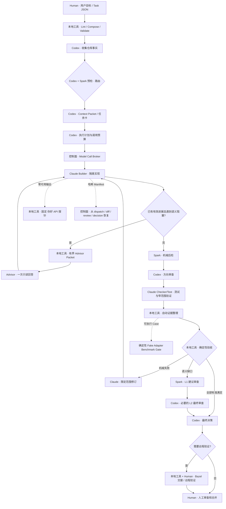

# AI Coding Workflow Skill

一个可复用的 Codex / Claude Code 工作流技能，用于将多智能体编码工作流安装到软件仓库中。

[English](README.md) | 中文

## 额度与时延协同路由

控制面现在优化“总完成成本”，而不是孤立追求模型调用最少。`python scripts/route-task.py task-hints.json` 通过确定性规则选择 **express、standard、assured、recovery** 四条通道。额度模式 `normal|constrained|critical` 与时延模式 `interactive|balanced|batch` 相互独立；普通任务仅在出现真实决策触发器时使用 Codex，高风险任务为架构和最终审查保留调用。

`quota-ledger.py` 管理调用预算并拦截重复 evidence；`evaluate-acceptance.py` 执行 L0 确定性验收；`select-review-tier.py` 选择 L0 本地/L1 Spark/L2 Codex；`context-cache.py` 复用有界定位证据；`check-retry-evidence.py` 阻止无新证据重试。`quota-efficient-balanced` Profile 将 Standard Review Packet 限制为 32 KB。

对于 Bazel 仓库，`build-bazel-context.py` 会把有界的目标文件列表转换为候选 BUILD rule、依赖、测试 target 和窄范围验证命令，且不会执行 Bazel。远程 Bazel 仍由人工控制：`generate-handoff.py` 只生成预览式发布、更新和合并 target 验证指令，`validation-ingest.py` 在本地分类返回日志；这些工具不会自动 push、SSH、merge 或批准验收。

额度优化的主入口默认只预览：

```bash
python scripts/aiwf.py run task.json --run-dir .ai-workflow/runs/T-1
# 先审查路由、Context、执行计划和 dispatch preview。
python scripts/aiwf.py run task.json --run-dir .ai-workflow/runs/T-1 --execute
```

`aiwf run` 串联 lint → Profile 组合与重验 → 仓库事实 → 确定性路由 → 缓存 Context Packet → 执行计划 → Broker 调度 Claude → 自动 Evidence Builder → 确定性验收 → Review Ladder → 远程交接/最终决策 → Ledger 与 Benchmark 指标。每一阶段都写入带内容哈希的产物，因此可从 dispatch、partial diff、review 或 decision 恢复，而不重复调用已经完成的 Claude。

底层控制面命令继续保留：

```bash
python scripts/aiwf.py efficient prepare --hints task-hints.json --task-card task.md --output-dir .ai-workflow/runs/T-1
python scripts/aiwf.py dispatch-efficient --plan .ai-workflow/runs/T-1/execution-plan.json --task-card task.md --output-dir .ai-workflow/runs/T-1/dispatch
# 审查 dispatch-preview.json 后，才显式添加 --execute。
python scripts/aiwf.py efficient review --plan .ai-workflow/runs/T-1/execution-plan.json --evidence evidence.json --milestone final-candidate --output .ai-workflow/runs/T-1/review.json
```

`prepare` 生成可缓存的 L0/L1/L2 Context Packet、重试基线和机器可读的 Spark 决策。非 Express 计划默认安排一次 `preflight-bundle`；Express/tiny、显式关闭和零预算跳过都会记录稳定原因码。加入 `--execute` 后，`dispatch-efficient` 会先运行计划中的 Spark 预检，再调度 Claude，保存 minimal Spark 证据和 `spark-dispatch.json`；Spark 自动禁用或失败时主流程继续。预览模式仍保持零模型调用。只有 Express Lane 能生成经确定性门控的 `mixed-exception` 单轮卡；`review` 先执行确定性验收，再决定 L1 Spark/L2 Codex。`aiwf loop` 仅作为 `legacy-full-codex-review` 兼容入口。

## 功能说明

ai-coding-workflow 可以为仓库自动配置：
- `AGENTS.md` - 所有智能体的共享规则
- `CLAUDE.md` - Claude Code 执行规则
- 任务卡和证据包模板
- Codex + Claude Code 工作流的安全调度/审查/循环脚本
- 非 Express 路由和机械审查默认使用 Codex Spark 辅助通道，tiny 任务必须记录显式跳过原因；同时支持任务卡审查、计划拆分、验证规划、失败归因、并行 DAG 规划、极小范围隔离 micro-builder 或窄范围可审计 controlled-builder 工作
- Execution profiles：默认省 token 的 balanced、完整上下文的 safe，以及显式大仓加速的 fast-large-repo
- 大型仓库调度选项：受管 worktree 复用，以及减少昂贵的未跟踪文件扫描
- 本地验证 gate，以及从任务卡 validation fenced block 自动抽取命令
- Builder / Checker-Test 任务模式，用于分离实现和验证职责
- Direction / Boundary Acknowledgement 方向/边界确认门，以及防反复确认规则
- 幂等更新的托管块（managed blocks）

## 工作流架构概览



完整控制循环为 **OBSERVE → ROUTE → PLAN → DISPATCH → EXECUTE → VERIFY → REVIEW → LEARN**。ROUTE 位于完整任务卡之前：确定性的 Express/tiny 任务记录 `skip.sized_tiny_fastpath`，其余任务默认使用一次短 Spark 预检。实现完成后，Spark 可压缩 diff 证据并进行机械后检，再交给 Codex 做方向和最终审查。Builder 已有有效、方向正确的进展且只剩一个明确语义阻塞时，可接收一次有界 Advisor 回答并在同一 worktree 继续；零进展、传输故障、审批阻塞和方向偏离均不符合条件。出现零可用输出时，调度器会先在同一路由执行固定 `claude -p '你好'`，再进行模型失败归因。Spark 始终只提供建议，不负责派发、验收或合并。Codex负责路由、规划和审查；Claude Builder负责委派实现；Claude Checker/Test负责被分配的测试。并行 Builder使用隔离 worktree，最终仍通过串行聚合审查汇合；人工审查和合并与自动派发保持分离。

## 常用动作

| 动作 | 时机 | 命令 |
|------|------|------|
| **引导式配置（预览）** | 查看 Skill、项目、工具和 doctor 四阶段计划 | `python scripts/update_skill.py --setup-current` |
| **引导式配置（执行）** | 一键更新 Skill、刷新项目、配置工具并检查 | `python scripts/update_skill.py --setup-current --apply` |
| **指定仓库配置（预览）** | 预览其他仓库的配置计划 | `python scripts/update_skill.py --setup-repo /path/to/repo` |
| **指定仓库配置（执行）** | 对其他仓库执行完整配置 | `python scripts/update_skill.py --setup-repo /path/to/repo --apply` |
| **安装 Skill** | 每台电脑一次 | `python scripts/install_for_codex.py` |
| **更新 Skill** | 拉取新版本后 | `python scripts/update_skill.py --bootstrap-current` |
| **引导项目** | 每个仓库一次 | `python scripts/install_workflow.py .` |
| **本地控制面引导** | 不希望提交 workflow 控制面文件的仓库 | `python scripts/install_workflow.py . --local-only` |
| **自动配置仓库（预览）** | 检测语言、规模以及 LSP/CodeGraph/Zoekt 计划 | `python scripts/install_for_codex.py --auto-setup /path/to/repo` |
| **自动配置仓库（执行）** | 安装缺失工具并初始化适用索引 | `python scripts/install_for_codex.py --auto-setup /path/to/repo --apply` |
| **刷新项目 workflow** | 已经引导过的仓库 | `python scripts/install_workflow.py . --update-workflow-files` |
| **Claude 供应商检查** | 脱敏显示 CC Switch 实际端点和模型 | `python scripts/claude-healthcheck.py` |
| **Claude 端点探测** | 仅提供网络诊断；瞬时失败不阻断派发 | `python scripts/claude-healthcheck.py --probe` |
| **Claude 交互探测** | 在调度网络环境中发送固定 `你好`；受限沙箱失败只算不确定，以用户终端成功交互为准 | `python scripts/claude-healthcheck.py --interaction-route auto --timeout 40` |
| **Advisor 延续包** | 一个语义阻塞得到回答后，在同一 worktree 继续已有有效实现 | `python scripts/aiwf.py advisor-continuation --help` |
| **跨沙箱进程检查** | 调度 PID 不可见时标记为未知，绝不能据此启动重复 Builder | `CLAUDE_CODE_PROCESS_VISIBILITY=auto bash scripts/status-claude.sh <task-id>` |
| **Claude 轮次分类** | 判断失败是否计入接管阈值 | `python scripts/classify-claude-attempt.py --exit-code N --outcome NAME` |
| **校验 Claude 上下文** | 检查 execution-only 上下文密度 | `python scripts/validate-claude-context.py task.md --require-complete` |
| **预览集成运行** | 零模型调用审查所有阶段 | `python scripts/aiwf.py run task.json --run-dir .ai-workflow/runs/T-1` |
| **执行集成运行** | 执行已审查的计划 | `python scripts/aiwf.py run task.json --run-dir .ai-workflow/runs/T-1 --execute` |

安装 Skill 只会让 Codex 发现该 workflow，不会自动在目标仓库创建或刷新 `ai/` 目录。已经引导过的项目会保留本地的 `ai/dispatch-to-claude.sh`、`ai/task-card-template.md` 等 workflow 副本。更新 Skill 后，需要使用 `update_skill.py --bootstrap-current` 或 `install_workflow.py . --update-workflow-files` 刷新这些本地副本。

如果目标仓库只想本地使用 `ai/`、`AGENTS.md`、`CLAUDE.md` 和 `.worktrees/`，不希望把这些控制面文件提交到业务仓库，使用 `--local-only`。它会把这些路径写入 `.git/info/exclude`，不会修改 `.gitignore`；`doctor_workflow.py` 会把这种配置识别为 local-only ignore mode。

## 仓库结构

```
ai-coding-workflow/
  README.md              ← 英文文档
  README_CN.md           ← 中文文档（本文件）
  LICENSE                ← MIT 许可证
  .gitignore
  SKILL.md              ← Codex 发现的技能入口
  agents/
    openai.yaml         ← OpenAI/Codex 技能元数据
  assets/
    AGENTS.md           ← 智能体规则模板
    CLAUDE.md           ← Claude Code 规则模板
    README.md           ← 本地使用指南模板
    task-card-template.md
    evidence-packet-template.md
    plan-task-template.md
    plan-findings-template.md
    plan-progress-template.md
  references/
    loop-model.md       ← 循环状态机和停止条件
    operating-model.md  ← 智能体角色和交接模型
    review-policy.md    ← 代码审查分工
    mcp-policy.md       ← 信息检索顺序
    benchmark-policy.md ← 质量 / 速度 / 成本 / 稳定性评估
  scripts/
    install_workflow.py ← 引导仓库
    install_for_codex.py← 安装技能供 Codex 发现
    update_skill.py     ← 便捷更新 Skill，并可选更新当前项目 workflow
    dispatch-to-claude.sh← 向 Claude Code 分发任务卡
    check-worktree.sh   ← 运行只检查不修改的验证并写入 checker report
    locate-code.py      ← 低 token 代码定位器，带有受限 CodeGraph 回退
    review-with-codex.sh← 向 Codex/GPT 发送证据审查
    run-codex-spark.sh  ← 可选 gpt-5.3-codex-spark 辅助运行器
    run-parallel-loop.sh← 实验性并行派发辅助脚本
    run-loop.sh         ← 可选循环运行器（调度 + 审查）
    doctor_workflow.py  ← 调度/审查循环就绪检查（只读）
    code-search-service.py ← 可选 Zoekt/Sourcegraph 设置和诊断
    clean_runtime.py    ← 预览/清理已忽略的运行时产物
    install_context_tools.py ← 检查/安装上下文工具（LSP、代码检查）
    summarize-loop-run.py ← 汇总 workflow 质量、速度、成本和稳定性
    init-plan.py        ← 创建 ai/plans/<task-id>/ 计划文件
    session-catchup.py  ← 根据计划和 artifacts 生成 resume-context.md
    validate-parallel-plan.py ← 校验并行 DAG 计划 JSON 是否符合 schema v1
    task_schema.py       ← 共享标准库加载器、校验器和 profile 组合器
    compose-profiles.py  ← 将 profile 与任务实例组合
    lint-task-card.py    ← 校验任务卡 JSON 是否符合 schema 和 profile
    render-task-card.py  ← 将任务卡 JSON 渲染为 Markdown
  schemas/
    task-card-v1.schema.json ← 任务卡 v1 的规范 JSON Schema
  profiles/
    base.json            ← 基础 profile，提供合理默认值
    bugfix.json          ← Bugfix profile，缩小范围和风险默认值
  examples/
    fix-typo-in-readme.json ← 示例任务卡
```

---

## JSON 任务卡（可选启用）

任务卡可以用结构化 JSON 代替（或配合）Markdown 编写。JSON 任务卡提供 schema 校验、确定性 profile 组合和机器可读的验收标准。现有 Markdown 任务卡和调度器完全不受影响——JSON 是可选新增功能。

### 源码检出命令

在克隆的 `ai-coding-workflow` 仓库中：

```bash
# 校验任务卡 JSON 是否符合 schema 和 profile
python scripts/lint-task-card.py task.json

# 组合并与任务实例合并
python scripts/compose-profiles.py task.json --output composed.json

# 渲染为 Markdown（audit 视图供人工审查，execution 视图供 Claude）
python scripts/render-task-card.py task.json --view audit
python scripts/render-task-card.py task.json --view execution
```

### 已安装项目命令

`install_workflow.py` 引导目标仓库后，工具在 `ai/` 下可用：

```bash
# 校验
python ai/lint-task-card.py ai/task-cards/PROJ-123.json

# 组合
python ai/compose-profiles.py ai/task-cards/PROJ-123.json --output composed.json

# 渲染
python ai/render-task-card.py ai/task-cards/PROJ-123.json --view execution
```

### JSON 作为可选启用的权威来源

当任务卡同时存在 `.json` 和 `.md` 版本时，JSON 文件是权威来源。Markdown 文件是人工可读的渲染结果。使用 `render-task-card.py` 从 JSON 重新生成 Markdown。

### 审计与执行渲染

- **审计视图**（`--view audit`）：包含所有部分——风险评估、扩展、完整交接合同。供人工审查。
- **执行视图**（`--view execution`）：仅包含与执行相关的部分——目标、范围、验收、验证、停止条件。供 Claude 调度。

### 冲突硬失败

Profile 组合是确定性的、失败即关闭的。如果两个 profile 对同一字段定义了冲突的标量值，组合会抛出错误而非静默选择其一。使用 `lint-task-card.py` 在调度前捕获冲突。

### 兼容传统 Markdown

Markdown 任务卡继续正常工作。调度器、模板和审查脚本均支持 Markdown。JSON 仅面向需要 schema 校验和结构化组合的团队可选使用。

### 已安装资产布局

引导后，结构化资产位于 `ai/` 命名空间下：

```
ai/
  task_schema.py              # 共享校验器和 profile 组合器
  compose-profiles.py         # CLI：组合 profile 与任务
  lint-task-card.py           # CLI：校验任务卡 JSON
  render-task-card.py         # CLI：将任务卡渲染为 Markdown
  schemas/
    task-card-v1.schema.json  # 规范 JSON Schema
  profiles/
    base.json                 # 基础 profile
    bugfix.json               # Bugfix profile
  examples/
    fix-typo-in-readme.json   # 示例任务卡
```

---

## 场景 A：在新电脑安装 Skill

将 Skill 安装到用户级 Codex skills 目录。每台电脑只需执行一次。

### Windows PowerShell

```powershell
git clone https://github.com/luozj1020/ai-coding-workflow.git
cd ai-coding-workflow
python .\scripts\install_for_codex.py
```

或手动安装：

```powershell
git clone https://github.com/luozj1020/ai-coding-workflow.git

$dst = "$env:USERPROFILE\.codex\skills\ai-coding-workflow"
Remove-Item -Recurse -Force $dst -ErrorAction SilentlyContinue
New-Item -ItemType Directory -Force "$env:USERPROFILE\.codex\skills" | Out-Null
Copy-Item -Recurse -Force ".\ai-coding-workflow" $dst
```

### macOS / Linux

```bash
git clone https://github.com/luozj1020/ai-coding-workflow.git
cd ai-coding-workflow
python scripts/install_for_codex.py
```

或手动安装：

```bash
git clone https://github.com/luozj1020/ai-coding-workflow.git
mkdir -p ~/.codex/skills
rm -rf ~/.codex/skills/ai-coding-workflow
cp -R ai-coding-workflow ~/.codex/skills/ai-coding-workflow
```

然后重启 Codex。

安装器会在安装完成后打印精确的项目引导命令。也可以在这个 Skill 仓库的克隆目录中，用一条命令完成“安装 Skill + 引导目标项目”：

```powershell
python .\scripts\install_for_codex.py --bootstrap-repo E:\path\to\your-project
```

```bash
python scripts/install_for_codex.py --bootstrap-repo /path/to/your-project
```

日常更新可以使用更短的 wrapper：

```bash
python scripts/update_skill.py
python scripts/update_skill.py --bootstrap-current
python scripts/update_skill.py --pull --bootstrap-repo /path/to/your-project
```

`python scripts/update_skill.py` 只更新用户级 Codex Skill。`--bootstrap-current` 和 `--bootstrap-repo` 会额外使用 `--update-workflow-files` 刷新目标仓库本地 workflow 文件，因此旧项目也能拿到新的 dispatcher、review prompt、模板和辅助脚本行为。

### 一键引导式配置

新版更新器可以把 Skill 更新、项目 workflow 刷新、环境感知工具配置和最终 doctor 检查串成一个流程。默认只预览，不写入任何内容：

```bash
python scripts/update_skill.py --setup-current
python scripts/update_skill.py --setup-repo /path/to/repo
```

确认四阶段计划后，显式添加 `--apply`：

```bash
python scripts/update_skill.py --setup-current --apply
python scripts/update_skill.py --setup-repo /path/to/repo --apply
```

执行顺序固定为：更新用户级 Skill、引导或刷新目标项目、根据仓库规模和已有工具配置 LSP/CodeGraph/Zoekt、运行 doctor。任一阶段失败都会立即停止并显示失败命令。Sourcegraph仍然只提供配置指引，不会自动部署。

如果从已安装的 Skill 入口运行，但希望用另一个克隆目录作为更新源：

```bash
python ~/.codex/skills/ai-coding-workflow/scripts/update_skill.py \
  --source /path/to/ai-coding-workflow \
  --bootstrap-current
```

安装 Skill 时，安装器会执行只读的上下文智能检查：
- LSP 工具，例如 `pyright`、`typescript-language-server`、`gopls`、`rust-analyzer`。
- CodeGraph CLI 是否可用。
- 使用 `--bootstrap-current` 或 `--bootstrap-repo` 时，目标仓库是否已经有 `.codegraph/` 索引目录。
- 可选 Zoekt / Sourcegraph 代码搜索服务是否可用。

安装器只打印建议，不会自动安装 LSP 工具，也不会自动运行 `codegraph init`。如需查看 LSP 安装建议，可运行 `python ~/.codex/skills/ai-coding-workflow/scripts/install_context_tools.py`；如需为某个仓库启用 CodeGraph，请在目标仓库内显式运行 `codegraph init`。

交互式安装 skill 时，安装器会询问是否配置可选代码搜索服务。非交互安装会跳过提示。也可以显式控制：

```bash
python scripts/install_for_codex.py --code-search-services ask
python scripts/install_for_codex.py --code-search-services skip
python scripts/install_for_codex.py --code-search-services check
```

大型仓库里应先使用有边界的代码定位器，而不是把宽问题直接交给 CodeGraph：

```bash
python ai/locate-code.py "需要修改的符号或行为" --path src --max-files 12
```

`locate-code.py` 使用 `git ls-files` 加 `rg`/`git grep` 生成候选文件、短 snippet 和精确读取命令。CodeGraph 仍适合具体符号和调用路径，但不再作为大型仓库的默认宽定位器。如果 Zoekt 已安装并完成索引，`--backend auto` 会先使用 Zoekt，再回退到 lexical search。已有 Sourcegraph 服务时，可通过 `SOURCEGRAPH_URL` 接入。CodeGraph 的 `auto` 模式会在 tracked file 数量超过阈值时跳过 CodeGraph；只有具体文件/符号查询才使用 `--codegraph try --codegraph-timeout 12`。

可选索引搜索设置：

```bash
python ai/code-search-service.py doctor
python ai/code-search-service.py install-zoekt --yes
python ai/code-search-service.py index-zoekt --repo . --yes
AI_CODE_LOCATOR_BACKEND=auto python ai/locate-code.py "需要修改的符号或行为"
```

`install-zoekt --yes` 会运行三个 `go install` 命令。helper 会流式打印命令输出；当 Go 下载或编译阶段长时间没有输出时，会定期打印 `still running...` heartbeat。可以把 `--progress-interval 5` 放在子命令前面来提高提示频率，或用 `--progress-interval 0` 关闭提示：

```bash
python ai/code-search-service.py --progress-interval 5 install-zoekt --yes
```

Sourcegraph 被视为外部/自托管服务，不是默认本地依赖。运行 `python ai/code-search-service.py sourcegraph-plan` 查看 Docker Compose 指南；服务可用后设置 `SOURCEGRAPH_URL`，需要鉴权时再设置 `SOURCEGRAPH_TOKEN`。

**测试是否生效：**

```
Use ai-coding-workflow to explain how to install the workflow in this repo.
```

如果 Codex 能回答并引用此 Skill 的安装器，说明 Skill 已生效。

---

## 场景 B：引导新项目

Skill 安装完成后，引导任意仓库。每个项目只需执行一次。这一步会在项目中创建 `ai/dispatch-to-claude.sh` 以及其他本地工作流文件。

### Windows PowerShell

```powershell
cd E:\path\to\your-new-project
python $env:USERPROFILE\.codex\skills\ai-coding-workflow\scripts\install_workflow.py .
```

### macOS / Linux

```bash
cd /path/to/your-new-project
python ~/.codex/skills/ai-coding-workflow/scripts/install_workflow.py .
```

这会在项目中生成或更新以下文件：

```
AGENTS.md
CLAUDE.md
ai/task-card-template.md
ai/evidence-packet-template.md
ai/plan-task-template.md
ai/plan-findings-template.md
ai/plan-progress-template.md
ai/README.md
ai/dispatch-to-claude.sh
ai/check-worktree.sh
ai/code-search-service.py
ai/locate-code.py
ai/review-with-codex.sh
ai/run-codex-spark.sh
ai/run-parallel-loop.sh
ai/run-loop.sh
ai/doctor_workflow.py
ai/clean_runtime.py
ai/install_context_tools.py
ai/summarize-loop-run.py
ai/benchmark-loop-runs.py
ai/init-spec.py
ai/plan-to-task-cards.py
ai/init-plan.py
ai/session-catchup.py
ai/validate-parallel-plan.py
.worktrees/.gitkeep
```

---

## 更新现有项目

再次运行相同命令。安装程序使用托管块来保留项目特定规则：

```powershell
# Windows
python $env:USERPROFILE\.codex\skills\ai-coding-workflow\scripts\install_workflow.py .
```

```bash
# macOS / Linux
python ~/.codex/skills/ai-coding-workflow/scripts/install_workflow.py .
```

默认情况下，`ai/` 下已经存在的 plain workflow 文件不会被覆盖。如果它们和已安装 Skill 不一致，安装器会报告 `outdated`。更新 Skill 后，要刷新已引导项目，请运行：

```bash
python ~/.codex/skills/ai-coding-workflow/scripts/install_workflow.py . --update-workflow-files
```

或者在 Skill 克隆目录中运行：

```bash
python scripts/update_skill.py --bootstrap-current
```

---

## 日常工作流程

工作流是一个显式循环：**观察  ->  计划  ->  调度  ->  执行  ->  验证  ->  审查  ->  学习  ->  重复。**

**核心原则：** Codex 负责设计和审查。Claude 负责编辑。工具优先收集低 token 证据。Codex 保持在低 token 上下文预算内；宽泛读取和多文件工作委托给 Claude。Claude 返回压缩证据（摘要 + 产物路径），而非粘贴大段日志。

对于非平凡修改，优先把 Claude 工作拆成两个角色：

- **Builder Claude** 负责按任务卡完成限定范围内的实现，并报告实现方向。除非任务卡明确允许窄范围 sanity check，否则不写 acceptance tests，也不运行大型测试套件。
- **Checker/Test Claude** 在 Codex 接受 Builder 方向后运行。它负责编写或更新被指派的测试、执行验证命令并报告证据，不做大范围实现重写。

任务卡可以要求 Claude 在编辑前执行 **Direction / Boundary Acknowledgement**。Claude 需要复述目标、范围、明确不做的边界、可能触碰的文件、验收标准理解、测试职责、困惑和风险。这是一个门禁，不是反复讨论循环：除非 Codex 实质性改变目标、范围、边界或风险，每个任务或阶段最多允许一次阻塞确认。Codex 必须给出唯一最终决策：proceed、narrow-once/re-dispatch、split 或 stop。

对于目标还不够明确的功能、UX、API 或数据模型改动，先写一个短 spec：

```bash
python ai/init-spec.py "功能或改动名称"
```

spec 用来记录期望行为、非目标、验收面、约束、备选方案和风险。任务卡中填写 `Spec Gate` 并链接该 spec。`ai/init-plan.py` 会创建带有 `### Task N: ...` 小节的 `task_plan.md`；评审这些小节后，可以生成小范围任务卡：

```bash
python ai/plan-to-task-cards.py ai/plans/PROJ-123/task_plan.md
```

bugfix 和 regression 修复前填写 `Root Cause Gate`。验收关键行为需要测试先行时，填写 `Test-First / TDD Contract`，明确生产代码修改前的 red evidence 和实现后的 green evidence。声明分支 ready 前，填写 `Finish Branch Gate`，记录新鲜验证和 artifact 分类。

阶段权责必须显式写清楚：

| 阶段 | Codex 负责 | Claude 负责 |
|------|------------|-------------|
| Observe / Plan | 证据、范围、任务卡、验收标准、职责门禁 | 除非被派发探索任务，否则不参与 |
| Builder Execute | 观察进度和审查实现方向 | 限定范围实现、更新进度、报告方向 |
| Direction Review | 决定等待、修订、拆分、派发 checker-test，或在阈值满足时接管 | 报告 blocker，避免反复确认 |
| Checker/Test | 派发验证任务并审查证据质量 | 被指派的测试、验证命令和失败证据 |
| Final Review | accept / revise / split / reject；人工合并保持独立 | 除非再次派发，否则不参与 |

小型低风险修改可以走 Codex-only fast path，不必派发 Claude。仅当改动局部、预计最多触及两个小文件、不需要广域上下文、没有 public API / 数据模型 / 安全 / 迁移 / 权限 / 并发 / 跨模块契约风险，并且有窄验证或明确的跳过验证理由时才使用。需要记录为什么没有派发 Claude、触及文件、验证证据，以及什么条件会升级回 Claude。只要 scope 扩大或出现不确定性，就停止 fast path，回到 task-card + Claude dispatch。

当 Claude 看起来卡住时，先归因再判断：任务卡歧义、混合角色任务、dirty source/stale HEAD、权限或审批拦截、长时间验证、缺少进度产物、外部环境，还是确实无进展。

权限或审批拦截包括 sandbox 写入被拒、禁止修改的文件、CLI 未认证、网络受限命令、需要人工批准的命令，以及任务卡明确写出的“不要读取或修改”路径。这类情况应写入 progress/report 产物，并按环境或编排 blocker 处理；只有在 Claude 忽略了可用的合规路径时，才应归因为 Claude 执行问题。

dirty source 或 stale HEAD 也应按同类逻辑处理：它会阻止可靠委托，但本身不是 Codex 接管实现的理由。应先恢复委托路径，例如提交已接受阶段、stash/patch 未提交改动、刷新 workflow 文件、从更新后的 HEAD 重新派发、请求明确的 dirty-source 派发批准，或停止等待人工处理。

**步骤 1：初始化项目**（一次性）

```powershell
python $env:USERPROFILE\.codex\skills\ai-coding-workflow\scripts\install_workflow.py .
```

**步骤 2：创建任务卡**（在 Codex 中  -  观察 + 计划）

```
Use ai-coding-workflow to create a task card for implementing <功能>.
```

对于有明确完成标准的循环任务，请填写任务卡中的 `Goal Loop Contract`。优先写清楚 success signal、最大尝试次数、重复失败停止阈值、无改进停止阈值、回归停止规则、必须提供的证据和 benchmark tags。宽泛或有歧义的工作先填 `Spec Gate`，bugfix/regression 修复先填 `Root Cause Gate`，需要 red-green 证据时填 `Test-First / TDD Contract`，声明 ready for merge 前填 `Finish Branch Gate`。需要更强模型、Codex reviewer 或人工专家在高风险工作前给建议时，填写 `Advisor Gate`，记录咨询时机、调用上限、输出预算、结果可见性、冲突调和和 fallback 行为。`Unknowns` 则用于记录 blindspot scan、会改变架构的问题、参考样例，以及 Claude 偏离原计划时应记录到哪里。

dispatch 默认使用 `balanced` execution profile：compact Claude task card、brief prompt、fresh worktree、完整 diff evidence。这会减少 prompt/task-card token，同时保留审查证据链。完整 Codex planning card 仍会复制为 `TASK_CARD_FULL.md`。

对于有歧义或高风险的任务，使用 `safe` 恢复 standard prompt 和非 compact execution card：

```bash
CLAUDE_CODE_EXECUTION_PROFILE=safe \
bash ai/dispatch-to-claude.sh ai/task-cards/PROJ-123.md
```

只有在填写 large-repo gate 并接受证据取舍后，才使用 `fast-large-repo`：

```bash
CLAUDE_CODE_EXECUTION_PROFILE=fast-large-repo \
bash ai/dispatch-to-claude.sh ai/task-cards/PROJ-123.md
```

`fast-large-repo` 会使用 managed reuse worktree、跳过无关 untracked 扫描，并写入 summary diff evidence 而不是完整 patch 文本。它不会 reset 源仓库。如果 `.worktrees/reuse/claude-managed` 已存在，请先保留或审查其中证据，再显式加入 `CLAUDE_CODE_REUSE_WORKTREE_RESET=1`，只 reset 这个受管 worktree。

大型仓库派发前应填写 `Claude Context Packet`。它应该很小、面向执行：目标文件/模块、相关符号、source-of-truth 示例、Claude 不应读取或修改的路径、已知约束，以及窄验证命令。如果这个 packet 不完整，Claude 应 stop-and-report，而不是重新广域扫描整个仓库。

**默认辅助通道：在规划前和实现后使用 Codex Spark**

如果你的 Codex 额度中 `gpt-5.3-codex-spark` 和强模型额度分开计算，适合的任务可以让 `Codex Spark Gate` 保持 `auto`。Spark 是辅助层，不是默认替代 Claude；优先用更便宜的 Spark 额度判断任务规模和路由，再消耗更贵的 Codex/Claude 强模型上下文。已经知道所需辅助角色时，优先显式传 `--mode`；只有需要低风险自动路由时才用 `auto`。预算模式由 `AI_SPARK_BUDGET_MODE` / `--budget-mode` 控制：`balanced`（默认）、`aggressive`（失败时额外启用修订起草职责）、`conservative`（传统单角色路由）。建议每个任务最多调用三次短 Spark helper——预检、可选的定向/失败角色、后检——这是工作流建议，不是跨进程守护或状态强制。如果 CLI、模型权限、auth、网络、Spark 额度不可用，或本地 helper 因 app-server 初始化需要写权限而失败，helper 会写入 auto-disabled report 并返回 0，让主 Claude/Codex 流程继续：

- `auto`：阶段路由 / 包选择。解析为适用的阶段包：普通 Builder 前使用解析为 `preflight-bundle`，diff/report/evidence 使用解析为 `postflight-bundle`，Checker/Test 保持 `validation-planner`，失败/无报告证据包含失败归因。在 aggressive 预算模式下，失败证据还额外启用修订起草职责。
- `task-size-classifier`：判断任务是 tiny/small/medium/large/unknown，并建议 `codex-fast-path`、`spark-review-only`、`spark-micro-builder`、`claude-builder`、`checker-test`、`spec-first` 或 `human-clarification`。可用时包含执行成本字段。
- `execution-cost-estimator`：只读模式，预测任务的 diff 范围/文件数和相对直接/委托工作量。工作量是相对估算，不是 token 计量。估算器返回机器可读字段：`predicted_diff_lines_low`、`predicted_diff_lines_high`、`predicted_files`、`context_scope`、`validation_complexity`、`delegation_overhead`、`estimated_direct_work_units`、`estimated_delegated_work_units`、`delegation_to_direct_ratio`、`economic_recommendation`、`safety_eligible`、`recommended_owner`、`confidence`、`risk_flags`、`reason` 和 `stop_condition`。仅当经济建议倾向 Codex 且确定性安全门通过时，才允许 Codex fast path：<=2 文件、本地上下文、低/无验证、高置信度、无风险标志，且上界 diff 在配置阈值内。阈值由 `--fast-path-max-diff-lines N` 或 `CODEX_FAST_PATH_MAX_DIFF_LINES` 控制（默认 100，有效范围 1..200）。这是派发前的 fast-path 决策，不是 Claude 接管后的决策；它永远不会自动编辑源码。估算器也包含在 `preflight-bundle` 和 `task-size-classifier` 输出中。
- `review-only`：快速只读审查任务卡或实现方向。
- `task-card-audit`：派发前检查缺失 gate、职责混合、验收不清和可能导致 Claude 卡住的风险。
- `plan-splitter`：建议更小的 Builder/Checker 任务卡，或可并行的独立切片。
- `validation-planner`：给出精确、低噪音验证命令，不运行广域测试。
- `failure-triage`：在 Claude 卡住/失败后读取有界 artifact 摘要，建议 wait / re-dispatch / narrow / takeover。
- `evidence-checker`：已有 artifacts 后快速检查证据质量。
- `parallel-planner`：为独立任务卡生成经过审查的 DAG 调度计划。Spark 只产出严格 schema-v1 JSON，不执行、不派发。Codex/人工必须审查并保存 JSON 计划后，再运行 `bash ai/run-parallel-loop.sh --plan <json>`。
- `micro-builder`：仅用于任务卡明确允许的极小范围修改，并在 helper 创建的隔离 worktree 中执行；任务卡必须允许 Spark 修改源码、限制为一两个小文件、排除公共 API/契约风险，并给出精确窄验证。
- `controlled-builder`：窄范围可审计的源码写入模式，需显式 `--allow-write` 路径（1–3 个）、必填 `--max-diff-lines`（1–200）、排除所有 public API/数据/安全/迁移/权限/并发/跨模块风险、需要已有 pattern/source-of-truth、强制 full artifacts 和隔离 worktree，运行后检查 tracked/untracked 路径/行数/二进制证据。违规时以非零退出码退出，保持隔离，不修改源码，不合并，不满足验收。Spark 结果交付模式：`direct`（advisory 默认，无永久目录）、`minimal`（stdout + 紧凑 report）、`full`（保留全部证据）。`--output` 不指定 `--result-mode` 时选 `minimal`；`--output --result-mode direct` 无效。源码写入模式强制 `full`。
- `observe-synthesizer`：只读模式，用于综合观察证据。
- `task-card-drafter`：只读模式，用于起草任务卡内容。
- `context-packet-builder`：只读模式，用于构建上下文包。
- `preflight-bundle`：只读阶段包，用于普通 Builder 前使用。
- `direction-precheck`：只读模式，用于预检实现方向。
- `acceptance-matrix`：只读模式，用于构建验收矩阵。
- `postflight-bundle`：只读阶段包，用于 diff/report/evidence 使用。
- `revision-drafter`：只读模式，用于起草修订说明。
- `lesson-extractor`：只读模式，用于从已完成工作中提取经验教训。
- `execution-cost-estimator`：只读模式，预测任务的 diff 范围/文件数和相对直接/委托工作量。工作量是相对估算，不是 token 计量。包含在 `preflight-bundle` 和 `task-size-classifier` 输出中。仅当经济建议倾向 Codex 且确定性安全门通过时才允许 Codex fast path。阈值：`--fast-path-max-diff-lines N` / `CODEX_FAST_PATH_MAX_DIFF_LINES`（默认 100，有效范围 1..200）。仅用于派发前决策；永远不会自动编辑源码。

包输出使用七个压缩标题：Decision Summary、Risk Flags、Scope and Boundaries、Acceptance Matrix、Evidence Conflicts、Required Codex Decisions、Recommended Next Action。

默认 auto 执行阶段路由：

```bash
bash ai/run-codex-spark.sh ai/task-cards/PROJ-123.md
```

当显式使用 `task-size-classifier` 模式，或 conservative 预算下的 auto 路由选中该模式时，helper 会在 Spark artifact 目录中用 `workspace-write` sandbox 启动 Codex。这样本地 helper 初始化有可写工作目录，但不会给源仓库写权限，且该模式仍禁止修改源代码。

`execution-cost-estimator` 模式及其在 `preflight-bundle`/`task-size-classifier` 中的包含支持 `--fast-path-max-diff-lines N` 标志（也可用 `CODEX_FAST_PATH_MAX_DIFF_LINES` 环境变量）来配置 Codex fast-path 资格的上界 diff 行数阈值。默认值为 100，有效范围为 1..200。当预测的上界 diff 超过此阈值时，无论经济建议如何，安全门都会拒绝 Codex fast path。

运行证据检查：

```bash
bash ai/run-codex-spark.sh ai/task-cards/PROJ-123.md --mode evidence-checker \
  --artifact .worktrees/claude-<id>.report.md \
  --artifact .worktrees/claude-<id>.checker-report.md
```

派发前运行任务卡审查或验证规划：

```bash
bash ai/run-codex-spark.sh ai/task-cards/PROJ-123.md --mode task-card-audit
bash ai/run-codex-spark.sh ai/task-cards/PROJ-123.md --mode validation-planner
```

对失败/卡住运行做归因：

```bash
bash ai/run-codex-spark.sh ai/task-cards/PROJ-123.md --mode failure-triage \
  --artifact .worktrees/claude-<id>.status.txt \
  --artifact .worktrees/claude-<id>.progress.log
```

生成经过审查的并行 DAG 计划：

```bash
bash ai/run-codex-spark.sh ai/task-cards/PROJ-123.md --mode parallel-planner
```

`parallel-planner` 只产出严格 schema-v1 JSON 和标准 reconciliation 字段。Spark 不执行、不派发；Codex/人工必须审查并保存 JSON 计划后，再运行 `bash ai/run-parallel-loop.sh --plan ai/plans/.../parallel-plan.json`。

只有任务卡明确允许时，才运行极小范围隔离修改：

```bash
bash ai/run-codex-spark.sh ai/task-cards/PROJ-123.md --mode micro-builder --sandbox workspace-write
```

Spark artifacts 会写入 `.worktrees/codex-spark-*`，包括 `codex-spark.report.md`、`codex-spark.prompt.md`、`codex-spark.result.txt`、`codex-spark.stderr.log`、`codex-spark.artifacts.txt`、`codex-spark.worktree-status.txt`，以及可选的 `codex-spark.diff`。helper 不会静默回退到 GPT-5.5 或其他强模型。Spark 永远不授权合并；强 Codex review 仍然必须；无隐式强模型回退；本次变更无模型层级路由。只有当 Spark 不可用也应该成为硬失败时，才使用 `--require-spark`。

Spark 输出是建议。把 `accepted_suggestions`、`ignored_suggestions`、`conflicts_with_claude`、`conflicts_with_local_evidence` 和 `acceptance_satisfied_by_spark` 写入 Spark follow-up 表。Spark 不能独立满足验收，不能替代 Claude Builder 责任，不能批准 Codex 最终 review，也不能授权合并。强 Codex review 仍然必须。无隐式强模型回退。本次变更无模型层级路由。对于多次报告的汇总/benchmark 聚合，记录：helper 调用次数、Spark 总调用次数、唯一 modes/stages/roles、预算模式、临时状态、强 review 要求、合并授权状态，以及 auto-disable 出现次数/原因。

**Spark 结果交付模式** 通过 `--result-mode` 控制结果的返回和持久化方式：

- **`direct`**（advisory/read-only 默认）：将原始结果发送到 stdout，使用清理后的临时工作区，不创建永久 Spark 目录。不会写入 `codex-spark.report.md` 或其他文件。只需要内联结果且不需要文件级指标时选择 `direct`。
- **`minimal`**：将原始结果发送到 stdout，仅持久化紧凑的 `codex-spark.report.md`。需要持久化指标或 benchmark 聚合但不需要完整证据时使用。
- **`full`**：保留 prompt、result、stderr、status、diff、task-card 和 manifest 证据。需要完整审计追踪时使用。

传入 `--output` 但未显式指定 `--result-mode` 时，helper 选择 `minimal`。`--output` 与 `--result-mode direct` 组合无效——`direct` 不创建持久化产物。源码写入模式（`controlled-builder`、`micro-builder`）强制使用 `full`。

**可观测性取舍：** `direct` 模式有意不提供文件级指标——没有 `codex-spark.report.md`、没有产物目录、没有 manifest。这是为轻量级 advisory 调用设计的。当需要跨多次 Spark 调用进行 benchmark 聚合、质量追踪或审计时，选择 `minimal` 或 `full`，以便 `ai/benchmark-loop-runs.py` 和 `ai/summarize-loop-run.py` 可以聚合结果。

**Spark 诊断（`--diagnostics`）：** 当 direct 模式调用产生不可用结果（空响应、可用性/执行失败、或 schema-invalid 估算器输出）时，`--diagnostics failure`（默认）在 `.worktrees/spark-diagnostic-<timestamp>/` 下写入紧凑的脱敏记录。stderr 摘要中的密钥会被剥离。`--diagnostics off` 禁用所有持久化。`--diagnostics full` 将所有证据复制到永久目录以供复现。成功调用始终保持零持久化。估算器输出被分类为 `schema-invalid` 时，除非设置了 `--require-spark`，否则自动禁用 Spark 并以 0 退出。

**Controlled-builder 权限模式** 为 Spark 提供窄范围、可审计的源码写入权限：

- 任务卡必须指定 1–3 个精确的 `--allow-write` 路径，并有对应的 `Controlled-builder allowed paths` 行。
- `--max-diff-lines` 为必填项，范围 1–200。
- 策略排除所有 public API、数据模型、安全、迁移、权限、并发和跨模块契约风险。
- 必须识别已有 pattern 或 source-of-truth。
- 需要窄验证——不运行大型测试套件。
- 运行后检查 tracked/untracked 路径、行数和二进制证据。
- 违规时以非零退出码退出，保持 worktree 隔离，不修改源码，不合并，不满足验收标准。

```bash
bash ai/run-codex-spark.sh ai/task-cards/PROJ-123.md --mode controlled-builder \
  --allow-write src/module.py --allow-write tests/test_module.py \
  --max-diff-lines 150 --sandbox workspace-write
```

`controlled-builder` 任务卡必须包含：

| 字段 | 值 |
|------|-----|
| Result mode | `full`（强制） |
| Controlled-builder 授权？ | yes |
| Controlled-builder 允许路径 | 精确 1–3 个路径 |
| 最大文件数 | 3 |
| 最大 diff 行数 | <=200 |
| 风险排除 | 每项一行：public API、数据模型、安全、迁移、权限、并发、跨模块 |
| 已有 pattern / source-of-truth | 文件或 pattern 引用 |
| 窄验证 | 精确命令 |

**大型仓库 / 慢文件系统**

如果大型项目里 `git worktree add`、文件系统读取、dispatcher status/diff 收集很慢，先在任务卡里填写 `Worktree / Large Repo Strategy Gate`。默认保留完整证据。当 gate 接受 managed reuse 和 summary evidence 取舍时，优先使用显式 fast profile：

```bash
CLAUDE_CODE_EXECUTION_PROFILE=fast-large-repo \
bash ai/dispatch-to-claude.sh ai/task-cards/PROJ-123.md
```

如果只想手动开启 managed reuse：

```bash
CLAUDE_CODE_WORKTREE_STRATEGY=reuse-managed \
CLAUDE_CODE_REUSE_WORKTREE_RESET=1 \
bash ai/dispatch-to-claude.sh ai/task-cards/PROJ-123.md
```

这只会复用 `.worktrees/reuse/claude-managed`，并且只 reset/clean 这个受管 worktree，绝不会 reset/clean 源仓库。
bootstrap 也会确保 workflow runtime artifacts 被忽略：

```gitignore
/.worktrees/*
!/.worktrees/.gitkeep
```

如果未跟踪文件扫描或未跟踪文件 patch 生成太慢，可以使用：

```bash
CLAUDE_CODE_LARGE_REPO_MODE=1 \
bash ai/dispatch-to-claude.sh ai/task-cards/PROJ-123.md
```

large-repo mode 会保留 tracked/staged diff 证据，但跳过昂贵的无关 untracked 扫描和 untracked patch 证据。使用前应在任务卡中记录这个证据取舍。

如果只想跳过完整 patch 文本、保留 worktree 供审查：

```bash
CLAUDE_CODE_EVIDENCE_MODE=summary \
bash ai/dispatch-to-claude.sh ai/task-cards/PROJ-123.md
```

**实验性：并行派发**

并行仍是显式选择，普通串行任务不会因此增加模型调用。推荐流程是：

1. 先用本地零 Token 判断器筛选候选，不读取全仓库，也不调用模型：

   ```bash
   python ai/assess-parallel-opportunity.py --json \
     --work-units 3 --write-scopes src/a,src/b,src/c \
     --estimated-minutes 30 --validation-count 3
   ```

2. 只有输出为 `parallel-candidate` 时，才进行一次受限的 Spark `parallel-planner` 调用；`serial-obvious` 直接编写单张串行任务卡。
3. Codex/人工审查任务卡和计划后，再显式运行并行器；默认最大并发为 2。
4. 派发前使用零 Token 的确定性校验检查写入范围、owned contracts、共同 Base commit（必须匹配当前 `HEAD`）和验证责任。
5. 每个结果仍然串行审查和合并。

| 判断器或 Gate 结果 | 下一步 | 额外模型调用 |
|--------------------|--------|--------------|
| `serial-obvious` | 创建一张普通串行任务卡 | 无 |
| `parallel-candidate` | 最多调用一次受限的 Spark `parallel-planner`，然后审查提案 | 一次 Spark 调用 |
| 候选被确定性校验拒绝 | 使用输出的串行回退顺序，不自动重新规划 | 无 |
| 候选通过 | 显式运行 `run-parallel-loop.sh`，通常设置 `--max-concurrency 2` | 每个就绪任务一次 Claude 派发 |

候选发现有意保持宽松，实际派发则严格检查写入范围、contracts、Base commit和验证责任。这样普通串行任务不会承担额外判断成本，同时避免并行条件严苛到永远无法触发。

有两种兼容路径：

*路径 1：扁平独立卡片（位置参数）*

对于文件/模块范围互不重叠的独立任务卡，在每张任务卡中填写 `Parallel Execution Gate`，然后运行：

```bash
bash ai/run-parallel-loop.sh --max-concurrency 2 \
  ai/task-cards/PROJ-123-a.md \
  ai/task-cards/PROJ-123-b.md
```

helper 会并发运行多个 `dispatch-to-claude.sh`，并写入 `.worktrees/parallel-*/parallel-summary.md`、`parallel-events.jsonl`、`parallel-manifest.tsv` 和每个任务的 dispatch 日志。任务卡必须写明 `Parallel allowed? | yes`、真实 Base commit、验证责任和窄写入范围。精确重叠保持退出码 3；父子路径、contract、base 或验证责任冲突在派发前以退出码 4 停止。`--allow-overlap` 仅用于显式的人工 reconcile 实验，不会绕过 contract、base 和验证责任检查。

*路径 2：经审查的 DAG 计划（`--plan`）*

对于需要依赖排序的并行执行，使用 Spark `parallel-planner` 生成经过审查的 DAG 计划：

```bash
bash ai/run-codex-spark.sh ai/task-cards/PROJ-123.md --mode parallel-planner
```

Spark 只产出严格 schema-v1 JSON，只提议不执行。Codex/人工必须审查并保存计划后再派发：

```bash
bash ai/run-parallel-loop.sh --plan ai/plans/PROJ-123/parallel-plan.json
```

Schema 字段：`schema_version`（必须为 `1`）、`group_id`、`max_concurrency`、`failure_policy`（目前仅 `skip-dependents`），以及 `tasks` 中每个任务的 `id`、`task_card`、`depends_on`。任务卡路径相对于计划文件解析。显式 CLI `--max-concurrency` 会覆盖计划中的并发上限。所有任务卡必须声明同一个真实 Base commit，并与运行时 `git rev-parse HEAD` 一致。

调度语义：调度器只启动依赖就绪的任务，不超过并发上限。使用 `skip-dependents` 时，失败的前置任务会跳过所有传递依赖，而无关分支继续执行。校验失败时只输出稳定的拓扑串行回退顺序，不会自动重新规划或自动执行。

这只是派发层并行，不会自动合并 worktree，不替代 Codex review，也不会让冲突实现变安全。每个 diff 仍需串行审查；共享 API、数据模型、全局配置等改动应走普通单任务流程，或单独创建人工 reconcile 任务卡。

**可选：为长任务创建持久计划文件**

```bash
python ai/init-plan.py PROJ-123
```

这会创建 `ai/plans/PROJ-123/task_plan.md`、`findings.md` 和 `progress.md`。如果上下文丢失或执行了 `/clear`，可生成恢复上下文：

```bash
python ai/session-catchup.py --plan PROJ-123
```

**步骤 3：调度 Builder Claude**（调度 + 执行）

```
Use the coding executor workflow. Execute this task card and return an evidence packet.
```

对于实现任务，将任务卡模式设为 `builder`。Builder Claude 负责限定范围内的代码修改和进度汇报。如果需要测试，应在任务卡中说明 Builder Claude 完成实现证据后停止，后续由 Codex 单独派发 `checker-test` 任务。

这会在 `.worktrees/` 下生成以下产物：

**代理行为：** `dispatch-to-claude.sh` 默认会在运行 Claude Code 前清理常见代理环境变量（`HTTP_PROXY`、`HTTPS_PROXY`、`ALL_PROXY`、`NO_PROXY` 及其小写形式）。这样 Codex 可以继续使用当前 shell 的代理，而 Claude Code 默认直连。若 Claude Code 必须继承代理，请运行：

```bash
CLAUDE_CODE_PROXY_MODE=inherit bash ai/dispatch-to-claude.sh ai/task-cards/PROJ-123.md
```

**网络诊断：** dispatcher 默认不检查网络状态。若需要记录 Claude 进程及其子进程的元数据级 socket 快照，可运行：

```bash
CLAUDE_CODE_NETWORK_MONITOR=1 bash ai/dispatch-to-claude.sh ai/task-cards/PROJ-123.md
```

这会生成 `*.network.log`，内容包括代理模式、已脱敏的代理设置、诊断工具可用性，以及每次心跳的 socket 状态摘要，例如 `established`、`syn_sent`、`close_wait`。它不会捕获 packet 内容、prompt、request body 或 token。如需额外连通性探测，可设置 `CLAUDE_CODE_NETWORK_HEALTHCHECK_URL`；dispatcher 会运行有边界的 `curl -I` healthcheck，并只把状态/输出写入 network log。

| 产物 | 说明 |
|------|------|
| `*.result.json` | Claude 原始 JSON 输出 |
| `*.status.txt` | Claude 标准错误 / 执行日志 |
| `*.network.log` | 启用 `CLAUDE_CODE_NETWORK_MONITOR=1` 时的可选元数据级网络诊断 |
| `*.diffstat.txt` | 已跟踪文件的 `git diff --stat` |
| `*.diff` | 完整差异，包含未跟踪实现文件 |
| `*.checker-report.md` | `ai/check-worktree.sh` 生成的只检查不修改验证报告 |
| `*.checker-logs/` | checker 命令的完整日志 |
| `*.source-status.txt` | 调度前源仓库状态 |
| `*.worktree-status.txt` | 执行后工作树状态 |
| `*.untracked.txt` | 未跟踪文件列表和 patch 证据 |
| `*.usage.txt` | Claude Token/费用使用摘要 |
| `*.report.md` | Claude 修改报告，供人工和 Codex 审查 |
| `*.claude-progress.md` | Claude 自报的里程碑进度，用于状态展示和审查证据 |
| `*.pid` | 该次调度记录的 Claude 子进程 PID |
| `*.progress.log` | 调度心跳、超时和完成日志 |
| `*.review.txt` | 持久化的 Codex 审查输出 |
| `*.codex-events.jsonl` | 可用时记录的 Codex 原始 JSON 事件 |
| `*.codex-usage.txt` | 可用时记录的 Codex 审查 Token/费用摘要 |

Claude 运行期间，`*.progress.log` 会同时记录产物增长和实现工作树变化。`ai/watch-claude.sh` 与 `ai/status-claude.sh` 会展示部分工作树的 diffstat/status。最初几个等待回合里，如果工作树仍在变化，应先对照任务卡审查部分 diff；若修改方向符合 plan，就继续等待 Claude 完成。只有当部分实现已经偏离 plan、风险过高，或不再产生有效进展时，才考虑中断 Claude。

如果任务卡要求 Direction / Boundary Acknowledgement，Claude 应先写出确认内容再编辑。若该确认是阻塞式审批，Codex 需要给出一次最终决策后 Claude 才继续。Codex 给出 `proceed` 后，Claude 应继续执行任务，不应围绕同一事项反复请求确认。

**步骤 4：Codex 审查实现方向**（审查）

```
Use ai-coding-workflow to review this execution evidence packet and diff. Decide accept / revise / split / reject.
```

要将 checker、token/费用和仓库状态证据纳入审查：

```bash
bash ai/review-with-codex.sh ai/task-cards/PROJ-123.md \
  .worktrees/claude-<id>.result.json \
  .worktrees/claude-<id>.diff \
  .worktrees/claude-<id>.checker-report.md \
  .worktrees/claude-<id>.usage.txt \
  .worktrees/claude-<id>.source-status.txt \
  .worktrees/claude-<id>.worktree-status.txt \
  .worktrees/claude-<id>.untracked.txt
```

如果 Builder 结果符合计划且需要验证，Codex 应再派发一个 `checker-test` 模式任务卡。Checker/Test Claude 编写或更新被指派的测试、运行指定验证命令并报告结果。随后 Codex 执行最终审查；风险较高时，Codex 可以再运行一次二次验证。

**步骤 5：循环或合并**

- 如果 **accept**：人工审查并合并。
- 如果 **revise**：更新任务卡的修订说明，回到步骤 3。
- 如果 **split**：分解为子任务卡。
- 如果 **reject**：重新规划。

**可选：使用循环运行器**

```bash
bash ai/run-loop.sh ai/task-cards/PROJ-123.md 5
```

循环运行器自动执行步骤 3-5，在接受、达到最大迭代次数或人工干预时停止。它还会写入 `.worktrees/loop-<timestamp>/loop-usage-summary.md`，汇总可用的 Claude 和 Codex 使用量。它不会自动合并。

**只检查验证：** 安装后的项目包含 `ai/check-worktree.sh`。优先运行任务卡里的精确验证命令：

```bash
bash ai/check-worktree.sh --task-card ai/task-cards/PROJ-123.md --no-discover --command 'tests=pytest tests/test_target.py'
```

dispatcher 会在 Claude 结束后记录 checker report，但默认关闭广域 discover，避免与当前任务无关的 pytest/ruff/mypy 噪音。需要 dispatcher 复跑精确命令时，传入 `CLAUDE_CODE_CHECKER_COMMANDS=$'tests=pytest tests/test_target.py'`；只有任务卡明确允许广域项目检查时，才设置 `CLAUDE_CODE_CHECKER_DISCOVER=1`。

**Checker 复用风险门：** 派发 `checker-test` 任务前，在任务卡中填写 Checker Reuse Risk Gate，包含以下精确行：Public API risk、Data model risk、Security risk、Migration risk、Permission risk、Concurrency risk、Cross-module risk、Production impact。每行必须为显式 `no` 才允许任务派生的 checker worktree 复用默认为 `reuse-managed`。缺失、`unknown`、`n/a`、`duplicate`、`high` 风险、DAG 或并行任务保持 `fresh`。环境变量 `CLAUDE_CODE_WORKTREE_STRATEGY=fresh|reuse-managed` 覆盖此默认。现有 reset 安全（`CLAUDE_CODE_REUSE_WORKTREE_RESET=1`）保持不变。

**权威验证时间线：** dispatcher 保留 Claude 阻塞状态。Checker ALL GREEN 是使最终状态设为 `passed` 的权威信号。Checker 失败则相应设置最终状态。

当传入 `--task-card` 时，checker 也会读取任务卡中的 validation fenced block：

```bash validation
bazel test //path/to:target
```

如果任务卡写明 `Local validation allowed? | no`，checker 会把 artifact collection 报告为 `OK`，把 validation 报告为 `SKIPPED by policy`；它不会运行命令，也不代表测试通过。适用于用户或仓库策略明确禁止本地测试的场景；报告里应只给出人类或 CI 可运行的命令。

**项目测试分层：** 这个 workflow 项目的测试分为快速检查和较慢的集成覆盖。按改动范围选择最小验证层级：

```bash
# Smoke：shell 语法和 whitespace
bash -n scripts/*.sh
git diff --check

# 日常编辑默认（不运行 worktree/installer 集成测试）
python scripts/run-tests.py quick

# 修改工作流编排时运行集成覆盖
python scripts/run-tests.py integration

# 发布前完整覆盖（CI 中也只运行一次）
python scripts/run-tests.py full
```

quick 层会排除创建临时仓库、worktree、调度进程或运行 installer 的 integration 文件。修改这些区域时使用 `integration`，发布前使用 `full`。PR 在 OS/Python 矩阵中只运行 quick；推送到 `main` 后，才在 Ubuntu/Python 3.12 上运行一次 full。

**Workflow 质量汇总：** `ai/run-loop.sh` 还会写入 `.worktrees/loop-<timestamp>/loop-quality-summary.md` 和 `.json`。也可以手动汇总已有运行：

```bash
python ai/summarize-loop-run.py .worktrees/loop-<timestamp> \
  --output .worktrees/loop-<timestamp>/loop-quality-summary.md \
  --json-output .worktrees/loop-<timestamp>/loop-quality-summary.json
```

汇总报告会固定输出 `Spark Status` 和 `Claude Evidence Classification` 两段。Spark 字段记录 enabled/invoked 状态、mode、model、artifact path、exit code、auto-disable reason、sandbox 和 strong-model fallback 状态。Claude evidence 会分类为 `diff + valid report`、`no report but diff accepted`、`diff without report`、`acknowledgement only`、`seeded report only`、`fallback report`、`valid report without diff` 或 `no useful progress`。

**Workflow benchmark 汇总：** 要把多次 loop run 聚合成轻量 living benchmark：

```bash
python ai/benchmark-loop-runs.py .worktrees/loop-* \
  --output .worktrees/workflow-benchmark.md \
  --json-output .worktrees/workflow-benchmark.json
```

benchmark 会聚合每次运行的 decision、quality score、elapsed time、dispatch 阶段耗时、token/cost、stability findings，并读取任务卡和报告中的 loop type、benchmark tags、advisor usage、Spark invocation/auto-disable/fallback 状态、Spark task-size classification / routing / confidence 与 parallel-dispatch usage。dispatch 阶段耗时包括 Claude startup、Claude execution、checker time 和 artifact finalization，前提是 progress log 中存在这些事件。

**追加式 loop 事件：** `ai/run-loop.sh` 会写入 `.worktrees/loop-<timestamp>/loop-events.jsonl`，记录 run start、iteration start、dispatch complete、review complete、decision、revision task created 和 stop reason。它保留恢复上下文，不重写旧观察。

**结构化进度记忆：** Claude 会维护包含稳定字段的 `CLAUDE_PROGRESS.md`：Goal、Current Phase、Next Check、Blocker、Last Update。这样长任务能持续锚定目标，又不需要把大日志塞回 prompt。

---

## Windows 注意事项

### PowerShell UTF-8 设置

Windows PowerShell 的控制台代码页, `$OutputEncoding` 和子进程编码不一致时，容易把中文等非 ASCII 文本写成乱码或 `?`。在 PowerShell 里编辑或生成中文文档前，先 dot-source helper：

```powershell
. .\scripts\pwsh-utf8.ps1
```

在已安装 workflow 的项目里，使用：

```powershell
. .\ai\pwsh-utf8.ps1
```

如需对后续 PowerShell 会话生效，可选择写入 profile：

```powershell
. .\ai\pwsh-utf8.ps1 -Persist
```

该 helper 会设置 console input/output encoding, `$OutputEncoding`, `PYTHONUTF8`, `PYTHONIOENCODING` 和 code page `65001`。优先使用它，不要临时手写 `chcp` 或用包含中文的 PowerShell here-string 做文本替换。

在 Windows 上，PATH 中的 `bash` 可能解析为 WSL 而非 Git Bash。如果 WSL 没有默认发行版，直接调用 `bash -n` 会失败。这并不意味着脚本无效。

安装程序（`install_workflow.py`）会显式搜索 Git Bash，当 bash 不可用时报告 `WARN_SKIPPED`，不会将其视为硬性失败。

**解决方案：**
1. 安装 Git for Windows，确保 `C:\Program Files\Git\bin` 在 PATH 中位于 WSL 之前
2. 安装 WSL 发行版（`wsl --install -d Ubuntu`）
3. 通过安装程序验证，而不是直接运行 `bash -n`

---

## 调度可观测性

`dispatch-to-claude.sh` 在 Claude Code 运行期间会在 `.worktrees/` 下写入 PID 和心跳日志：

- `.worktrees/claude-<id>.pid` 记录 Claude 子进程 PID。
- `.worktrees/claude-<id>.progress.log` 记录启动、心跳、超时和完成事件。
- 最终化后的机器可读状态字段：`overall_running=yes`、`running=no`、`claude=not-running`。只有 dispatcher 设置这些字段；Claude 不自行最终化状态。
- `CLAUDE_CODE_HEARTBEAT_SECONDS` 控制心跳频率，默认 `30`。
- `CLAUDE_CODE_TIMEOUT_SECONDS` 控制最长运行时间，默认 `600` 秒；设为 `0` 可禁用超时。
- `CLAUDE_CODE_NO_OUTPUT_TIMEOUT_SECONDS` 可选地在 result/status/report/progress 产物长期无变化时停止 Claude；默认 `0` 为禁用，仅在需要快速失败时设为正数。
- `CLAUDE_CODE_WORKTREE_PROGRESS` 控制 worktree 进度详细程度。默认 `quiet` 显示紧凑时间和路径；`verbose` 显示详细 worktree 状态。
- `CLAUDE_CODE_APPROVAL_BLOCKED_CONVERGENCE` 启用保守的审批阻塞早期收敛。默认 `1`（启用）；设为 `0` 可禁用。启用后，如果存在完整报告、变更仅为测试范围、存在精确验证审批阻塞器、且观察到两次稳定心跳，dispatcher 会触发 checker helper。这不是验证成功或验收——这是 checker 的早期证据收集路径。

`dispatch-to-claude.sh` 会在 Claude 启动后和完成摘要中直接打印可复制的 `Watch Progress` 和 `Watch Details` 命令，用户无需打开文档或 artifact 文件就能在 Codex CLI 查看进度。

`watch-claude.sh` 默认展示低成本状态面板：运行状态、elapsed/quiet 秒数、基于 checklist 的进度条、最新里程碑、artifact 大小和简短 stuck-run 分析。除非传入 `--details`，或同一运行已经连续多次出现可疑快照，否则不会打印完整 progress/status/network 尾部。默认升级规则是连续 3 次可疑快照；可用 `--escalation-confirmations` 或 `CLAUDE_CODE_MONITOR_ESCALATION_CONFIRMATIONS` 调整。

`watch-claude.sh` 和 `status-claude.sh` 还会打印机器可读监控字段（`monitor_level`、`action`、`evidence_state`、quiet/elapsed 秒数，以及可用时的 suspect count）。Codex 应优先读取这些低 token 字段，再决定是否展开完整 status、progress 或 network tail。

监控优先级应保守编排，尽量避免误杀 Claude：

1. L0：先看紧凑版 `watch-claude.sh` heartbeat/progress。
2. L1：当 worktree 有变化时审查 partial diff；若符合任务卡就继续等待。
3. L2：连续多次可疑快照后，再调用 `status-claude.sh` 或 watch details。
4. L3：超过 interrupt window 后，再综合 progress、status、diff、process 和可选 network 诊断。
5. L4：只有多个证据源都表明有效进展不太可能时，才使用 `kill-claude.sh`。

即使 Claude 超时或非零退出，调度器仍会尽量收集 diffstat、diff、未跟踪文件、usage fallback、worktree status 和 fallback report。

对于复杂或多次修订的任务，在任务卡中添加 `## Execution Phases` 表。Claude 必须将它作为外层执行合同，在阶段边界更新进度，并在长时间验证或跨过停止门之前写入 `CLAUDE_REPORT.md`。
```bash
CLAUDE_CODE_TIMEOUT_SECONDS=600 CLAUDE_CODE_HEARTBEAT_SECONDS=15 \
  bash ai/dispatch-to-claude.sh ai/task-cards/PROJ-123.md
```

---

## 控制面例外

默认角色分工是：Codex 负责规划/审查，Claude Code 负责修改。例外情况是 workflow 控制面自身损坏：如果 dispatcher、installer、review script 或 loop runner 阻止了安全分发或证据收集，Codex 可以在记录任务卡和验证证据后做窄范围热修。该例外只用于恢复 workflow 本身；普通产品/代码修改仍应回到 Claude Code 执行。

## Claude 调度运维

当 Claude 运行缓慢、卡住或需要清理时，可以使用以下辅助脚本：

```bash
# 查看最近一次 Claude 运行状态，或传入具体 claude-<timestamp> id
bash ai/status-claude.sh
bash ai/status-claude.sh claude-20260701-093934

# 只停止该 dispatch 的 PID artifact 记录的 Claude 进程
bash ai/kill-claude.sh claude-20260701-093934

# 移除已停止的 worktree，同时保留 .worktrees/claude-<id>.* 证据 artifact
bash ai/cleanup-worktree.sh claude-20260701-093934

# 只预览某一次已停止 dispatch 及其相邻运行时产物
python ai/clean_runtime.py --task-id claude-20260701-093934

# 只删除这一次 dispatch 的运行时产物
python ai/clean_runtime.py --task-id claude-20260701-093934 --apply
```

`cleanup-worktree.sh` 会在记录的 Claude PID 仍存活时拒绝运行。仅当 `git worktree remove` 因损坏或 dirty worktree 需要时才使用 `--force`。
`clean_runtime.py --task-id ...` 适合大仓库恢复场景，因为它避免广域 root artifact 清理，并保留其他 dispatch。

---

## 保留约束

以下约束在所有工作流变更中保留：

- **无模型层级：** 没有自动的模型层级路由或从 Spark 到 Claude 到更强模型的升级。
- **无隐式回退：** Spark 不会静默回退到 GPT-5.5 或其他更强模型。如果 Spark 不可用，报告缺口并让 Codex 或人工决定。
- **无自动合并：** 人工审查和合并保持独立。工作流永不自动合并。

---

## 安全策略

以下操作需要**明确的人工批准**才能执行：

- 破坏性命令（如 `rm -rf`、`DROP TABLE`、`git push --force`、`git reset --hard`）
- 文件删除
- 数据库迁移
- 认证或授权变更
- 计费或支付变更
- 部署或基础设施变更
- 公共 API 表面变更
- 密钥或凭据编辑（API 密钥、令牌、密码）
- 生产数据变更

智能体不得擅自执行上述操作。如有疑问，请停止并询问人工。

---

## 验证安装

运行以下命令确认安装成功：

```powershell
# Windows PowerShell
mkdir $env:TEMP\ai-workflow-test
cd $env:TEMP\ai-workflow-test
git init
python $env:USERPROFILE\.codex\skills\ai-coding-workflow\scripts\install_workflow.py .
python $env:USERPROFILE\.codex\skills\ai-coding-workflow\scripts\install_workflow.py .
```

```bash
# macOS / Linux
mkdir /tmp/ai-workflow-test
cd /tmp/ai-workflow-test
git init
python ~/.codex/skills/ai-coding-workflow/scripts/install_workflow.py .
python ~/.codex/skills/ai-coding-workflow/scripts/install_workflow.py .
```

预期结果：
- AGENTS.md 存在
- CLAUDE.md 存在
- ai/ 目录存在
- ai/doctor_workflow.py 存在
- .worktrees/.gitkeep 存在
- 第二次运行报告文件未变/已跳过

**运行工作流 doctor 检查就绪状态：**

```bash
python ai/doctor_workflow.py
```

如果 doctor 报告 `Project workflow is not bootstrapped`，按它打印的 bootstrap 命令先引导项目。仓库没有本地 `ai/` 工作流目录时，不能直接运行 `bash ai/dispatch-to-claude.sh ...`。

**清理运行时产物：**

```bash
# 预览将要删除的内容（干运行）
python ai/clean_runtime.py

# 实际删除产物
python ai/clean_runtime.py --apply

# 大仓库：只预览某一次已停止 dispatch 及其相邻产物
python ai/clean_runtime.py --task-id claude-20260709-120000

# 大仓库：只删除这一次 dispatch 的运行时产物
python ai/clean_runtime.py --task-id claude-20260709-120000 --apply
```

`doctor_workflow.py` 以预览模式运行：显示运行时产物的数量、大小和年龄。它不会自动删除任何内容。

**检查上下文工具：**

```bash
# 检查哪些 LSP/代码检查工具可用（只读）
python ai/install_context_tools.py

# 显示某个 profile 的安装命令（干运行）
python ai/install_context_tools.py --apply python --manager npm

# 实际安装（需要 --apply、--manager 和 --yes）
python ai/install_context_tools.py --apply python --manager npm --yes
```

上下文工具助手检查常见的 LSP、代码检查和代码智能工具（pyright、ruff、mypy、typescript-language-server、gopls、rust-analyzer）。默认调用为只读。实际执行包管理器命令需要三个标志：`--apply PROFILE`、`--manager MANAGER` 和 `--yes`。

注意：安装上下文工具二进制文件不会自动将它们暴露为 Codex LSP/codegraph 工具。Codex 代理需要单独配置才能使用它们。

---

## 开发验证

修改安装器或工作流脚本前，运行本地 smoke tests：

```powershell
python scripts/run-tests.py quick
```

测试只使用 Python 标准库，覆盖安装器幂等性、managed block 用户内容保留、`CLAUDE.md` import 位置，以及 Codex skill 复制时的运行时产物排除规则。

## 许可证

MIT 许可证 - 详见 [LICENSE](LICENSE)

## 链接

- GitHub 仓库: https://github.com/luozj1020/ai-coding-workflow
- 问题反馈: https://github.com/luozj1020/ai-coding-workflow/issues
